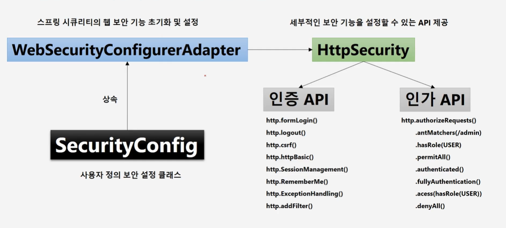
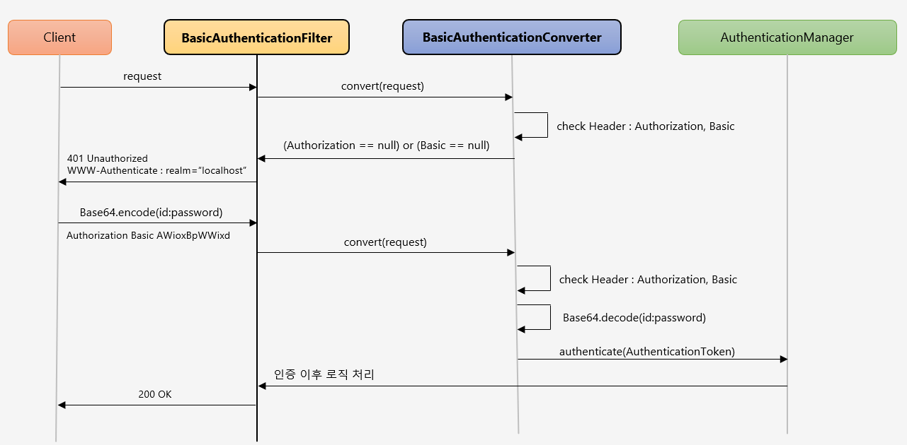
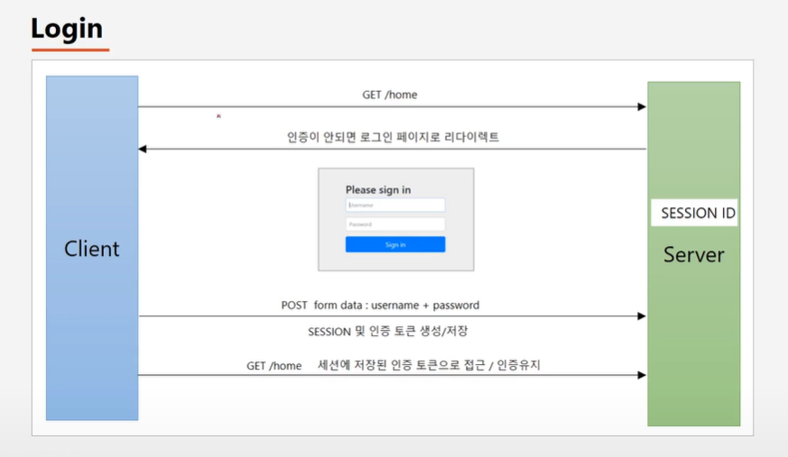
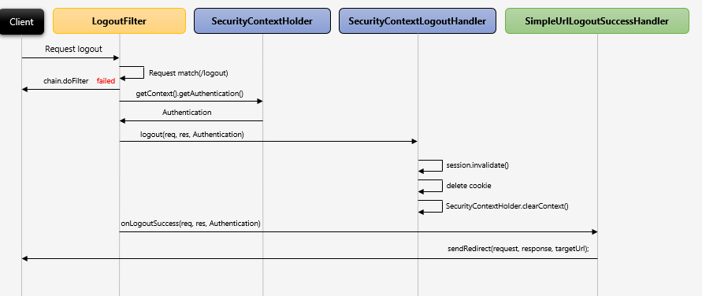
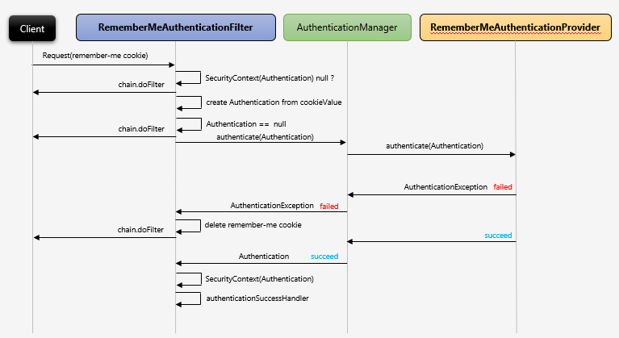

## 프로젝트 구성 및 의존성 추가 ~ Remember Me 인증 정리

# 인증 API – 프로젝트 구성 및 의존성 추가

```xml
  <dependency>
      <groupId>org.springframework.boot</groupId>
      <artifactId>spring-boot-starter-security</artifactId>
  </dependency>
```

- root page에 접근하기 위해서는 스프링 시큐리티의 인증/인가를 통과해야함
  - `login form방식`과 `HttpBasic 방식` 제공
    - HttpBasic방식(자격 유무 체크)
      - 클라이언트가 Authorization header에 사용자의 이름과 비밀번호를 Base64인코딩하여 보냄
      - 전송을 위한 인코딩이기 때문에 암호화되지 않음(자격 증명의 기밀성 보장X)
- Security Context 로딩 시점에 하나의 기본 계정 제공
  - id는 `user`로 고정, password는 랜덤한 `UUID방식`으로 제공

<br/>

# 인증 API – 사용자 정의 보안 기능 구현


Spring Security는 하나의 계정만을 제공하기 때문에 DB연결, 권한추가와 같은 세부적인 설정을 위해서는 사용자 정의 보안 기능을 구현해야한다.

```java
  @Configuration
  @EnableWebSecurity
  public class CustomWebSecurityConfiguration extends WebSecurityConfigurerAdapter {

    @Override
    protected void configure(HttpSecurity http) throws Exception {
        ...
    }

    @Override
    public void configure(WebSecurity web) throws Exception {
      ...
    }
  }
```

- **WebSecurityConfigurerAdapter**
  - 기본적인 보안 기능 제공
- **@Configuration**
  - component scan이 해당 클래스를 설정파일 빈으로 등록
- **@EnableWebSecurity**
  - Spring Security Filter Chain 자동 활성화와 웹 보안 설정을 구성
- **configure(WebSecurity web)**

  - HttpSecurity보다 상위에 있음.
  - 보안과 상관없는 엔드포인트(로그인 페이지, 공개페이지, 페이지 이동 API등)에 대해 사용권장

```java
  @Override
  public void configure(WebSecurity web) throws Exception {
      web.ignoring().antMatchers("/health", "/health/**");
  }
```

- ignoring()에 설정된 엔드 포인트('/health')는 Spring Security Filter Chain을 적용하지않아 security context에 설정되지 않음

- **configure(HttpSecurity http)**

```java
/** WebSecurityConfigurerAdapter에 정의된 메소드 */
  protected void configure(HttpSecurity http) throws Exception {
      this.logger.debug("Using default configure(HttpSecurity). If subclassed this will potentially override subclass configure(HttpSecurity).");
      http.authorizeRequests((requests) -> {
          ((ExpressionUrlAuthorizationConfigurer.AuthorizedUrl)requests.anyRequest()).authenticated();
      });
      http.formLogin();
      http.httpBasic();
  }
```

- 주요 설정요소
  - 리소스 접근 권한 설정
  - 커스텀 로그인 페이지 지원
  - 인증 후 성공/실패 핸들링
  - 사용자 로그아웃
  - CSRF 공격으로부터 보호
    - `CSRF(Cross Site Request Forgery)`란 해커가 타인의 권한을 도용하여 CRUD를 특정 사이트에 요청하게하는 공격
    - 3가지 조건을 만족해야함
      - 사용자가 보안이 취약한 서버로부터 이미 인증을 받은 상태
      - 쿠키 기반으로 서버 세션 정보를 획득 가능
      - 해커는 서버 요청 방법을 미리 알아야함(예상 가능한 파라미터 사용)

```java
  /** WebSecurity와 비교하기 위해 구현한 메소드 */
  @Override
  public void configure(HttpSecurity http) throws Exception {
      http.csrf().disable()
          .authorizeRequests()
          .antMatchers("/health", "/health/**").permitAll()
          .anyRequest().authenticated();
  }
```

- permitAll()에 설정된 엔드포인트('/health')는 인증을 하지않지만 Spring Security Filter Chain을 적용

<br/>

# 인증 API – HTTP Basic 인증, BasicAuthenticationFilter

```java
protected void configure(HttpSecurity http) throws Exception {
	http.httpBasic();
}
```



### 인증되지 않은 사용자의 요청에 대한 처리과정


- 인증되지 않은 클라이언트가 /private에 리소스에 대한 요청
- `AuthorizationFilter`는 인증되지 않은 요청에 `AccessDenidedException`반환
  - 이때의 AuthenticationEntryPoint는 `BasicAuthenticationEntryPoint`

<br/>

### 사용자 인증시도 처리과정


- 클라이언트가 로그인시도
- `BasicAuthenticationFilter`는 HTTP 요청에서 Authorization헤더나 Basic으로 시작하는 값 포함 확인
- 있을 경우 헤더를 추출하여 `UsernamePasswordAuthenticationToken`을 생성
- `AuthenticationManager`는 이 토큰을 받아서 사용자 인증
  - **인증 성공**
    - `SecurityContextHolder`에 사용자 정보 설정
    - `RememberMeServices.loginSuccess` 호출하여 추가 작업 수행
    - `BasicAuthenticationFilter`은 FilterChain.doFilter(request, response)를 호출
  - **인증 실패**
    - SecurityContextHolder, 사용자 정보 초기화
    - `RememberMeServices.loginFail`호출하여 추가 작업 수행
    - `AuthenticationEntryPoint` 호출로 `WWW-Authenticate` 발생시켜 재인증 유도

<br/>

# 인증 API – Form 인증

```java
protected void configure(HttpSecurity http) throws Exception {
	http
		.formLogin(withDefaults());
	// ...
}
```



### 인증되지 않은 사용자의 요청에 대한 처리과정


- 인증되지 않은 클라이언트가 /private에 리소스에 대한 요청
- `AuthorizationFilter`는 인증되지 않은 요청에 `AccessDenidedException`반환
  - 이때의 AuthenticationEntryPoint는 `LoginUrlAuthenticationEntryPoint`
- 로그인 페이지 리다이렉트

### 사용자 인증시도 처리과정


- 클라이언트가 로그인 시도
- `UsernamePasswordAuthenticationFilter`가 `HttpServletRequest`에서 사용자 정보 추출후 `UsernamePasswordAuthenticationToken`생성
- `AuthenticationManager`는 이 토큰을 받아서 사용자 인증
  - **인증 성공**
    - `SessionAuthenticationStrategy`에 새로운 로그인을 알려 세션생성
    - `SecurityContextHolder`에 `Authentication`설정
    - `RememberMeServices.loginSuccess` 호출하여 추가 작업 수행, 없을 경우 수행X
    - `ApplicationEventPublisher`가 `InteractiveAuthenticationSuccessEvent`발생
    - `AuthenticationSuccessHandler`호출
      - ExceptionTranslationFilter가 로그인 페이지로 리디렉션할 때 저장한 요청으로 리디렉션
  - **인증 실패**
    - SecurityContextHolder, 사용자 정보 초기화
    - `RememberMeServices.loginFail`호출하여 추가 작업 수행, Rememberme를 생성하지 않은 경우 작업수행X
    - `AuthenticationFailureHandler` 호출

### API

```java
protected void configure(HttpSecurity http) throws Exception {
  http
      .formLogin() // form login형식
      .loginPage("/loginPage") // 사용자 정의 로그인 페이지
      .defaultSuccessUrl("/") // 로그인 성공 후 이동 페이지
      .failureUrl("/login") // 로그인 실패 후 이동 페이지
      .usernameParameter("userId") // 아이디 파라미터명 설정
      .passwordParameter("passwd") // 패스워드 파라미터명 설정
      .loginProcessingUrl("/login_prac") // 로그인 Form Action Url
      .successHandler(new AuthenticationSuccessHandler() { // 로그인 성공 후 핸들러
          @Override
          public void onAuthenticationSuccess(HttpServletRequest request, HttpServletResponse response, Authentication authentication) throws IOException, ServletException {
              System.out.println("authentication" + authentication.getName());
              response.sendRedirect("/");
          }
      })
      .failureHandler(new AuthenticationFailureHandler() { // 로그인 실패 후 핸들러
          @Override
          public void onAuthenticationFailure(HttpServletRequest request, HttpServletResponse response, AuthenticationException exception) throws IOException, ServletException {
              System.out.println("exception" + exception.getMessage());
              response.sendRedirect("/login");
          }
      })
      .permitAll(); // 로그인페이지 접근은 누구나에게 허용
}
```

<br/>

# 인증 API – Logout, LogoutFilter

```java
protected void configure(HttpSecurity http) throws Exception {
	http
		.logout();
	// ...
}
```



### 사용자 로그아웃 처리과정

- 클라이언트가 `LogoutFilter`로 logout를 POST요청
- `AntPathRequestMatcher`가 /logout 경로 확인
  - 아닐 경우 chain.doFilter를 수행
- `SecurityContext`가 사용자정보가 담긴 Authentication을 Filter에게 전달
- `SecurityContextLogoutHandler` 실행
  - 세션 무효화
  - 쿠키 삭제
  - SecurityContextHolder.clearContext()로 Authentication 객체 삭제
- 정상작동시 `SimpleUrlLogoutSuccessHandler`에 설정된 페이지로 리다이렉트

<br/>

### API

```java
  protected void configure(HttpSecurity http) throws Exception {
    http
        .logout() // 로그아웃 기능 작동
        .logoutUrl("/logout") // 로그아웃처리 URL
        .logoutSuccessUrl("/login") //로그아웃 성공 후 이동페이지
        .addLogoutHandler(new LogoutHandler() { //로그아웃 핸들러
            @Override
            public void logout(HttpServletRequest request, HttpServletResponse response, Authentication authentication) {
                HttpSession session = request.getSession();
                session.invalidate(); // 세션 무효화
            }
        })
        .logoutSuccessHandler(new LogoutSuccessHandler() {  //로그아웃 성공 후 핸들러
            @Override
            public void onLogoutSuccess(HttpServletRequest request, HttpServletResponse response, Authentication authentication) throws IOException, ServletException {
                response.sendRedirect("/login"); //로그아웃 성공 후 이동페이지
            }
        })
        .deleteCookies("JSESSIONID", "remember-me"); // 사용자 정보, 로그인저장 쿠키 삭제
  }
```

<br/>

# 인증 API – Remember Me 인증

```java
  protected void configure(HttpSecurity http) throws Exception {
    http
        .rememberMe();
  }
```

- 세션이 만료 or 웹 브라우저가 종료된 후에도 어플리케이션이 사용자를 기억하는 기능
- Remember-Me 쿠키에 대한 Http 요청을 확인한 후 토큰 기반 인증으로 유효성을 검사 후 토큰이 검증되면 사용자 로그인
- rememberme기능 사용시 `remember-me` 쿠키 생성하기 때문에 쿠키를 통해 새롭게 인증가능하여 JSESSIONID없이 인증처리 가능

  

- rememberme기능 설정할 경우 `RememberMeAuthenticationFilter` 실행
  - 실행 조건
    - **Authentication 객체가 null인 경우**
      - 이미 인증을 받은 사용자의 세션이 만료되었거나 브라우저가 종료되어 현재 세션에서 Authentication객체를 찾을 수 없는 경우, Remember-Me 인증 필터가 동작하여 사용자 재인증
    - **remember-me 쿠키가 존재하는 경우**
      - 최초 사용자 인증 시 Remember-Me활성화햐여 서버 접속
      - remember-me 쿠기가 이미 존재하기 때문에 사용자를 자동으로 인증하여 새로운 세션 생성
- RememberMeServices 인터페이스
  - 메모리에 저장된 토큰과 쿠키에 저장된 토큰을 비교하여 인증 처리
    - `TokenBasedRememberMeServices `
      - 만료기간이 있는 쿠키, 기본 14일
    - `PersistentTokenBasedRememberMeServices`
      - 만료기간이 없는 쿠키
- remember-me 토큰을 사용하여 인증처리 후 새로 생성된 인증객체를 `AuthenticationManage`에게 전달
