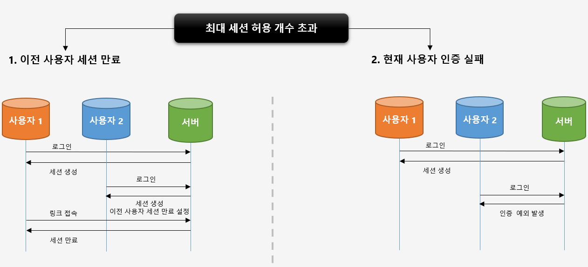
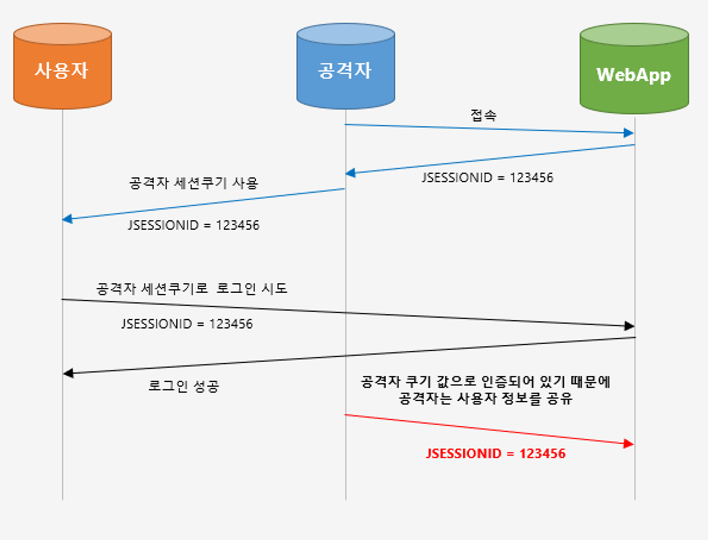
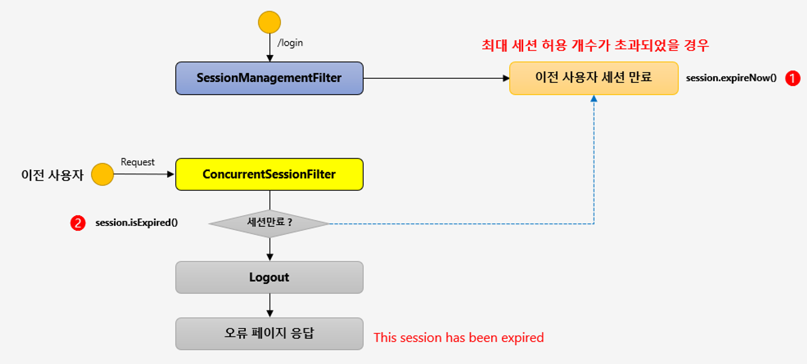
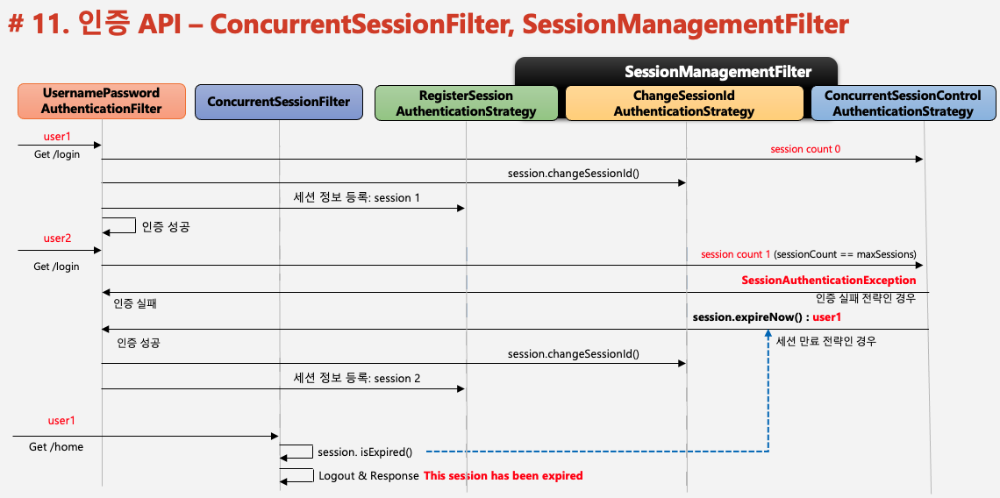
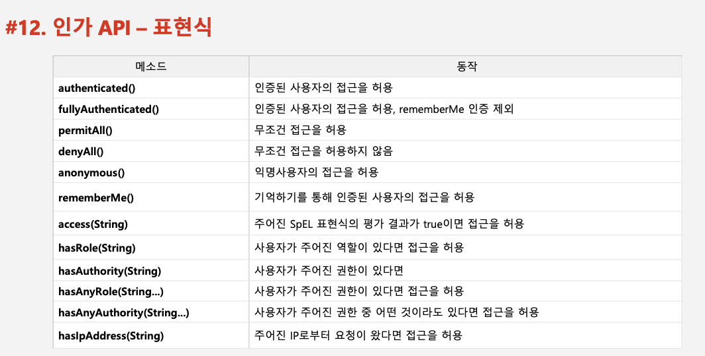
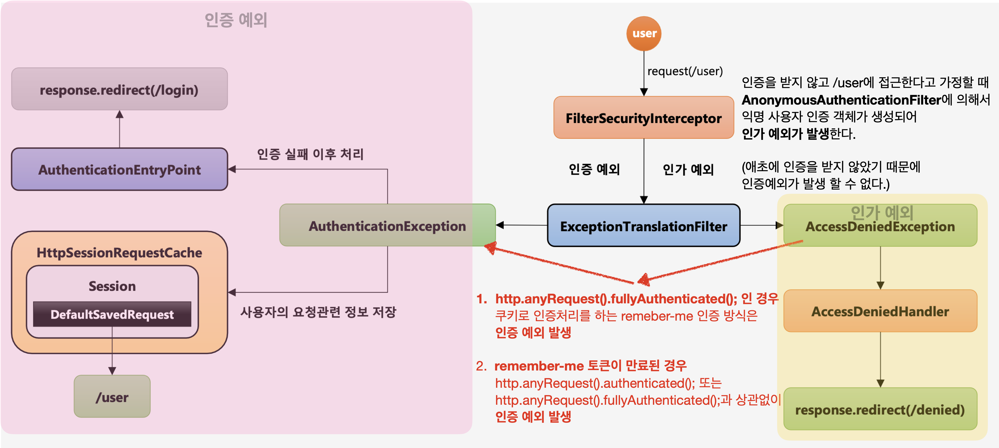
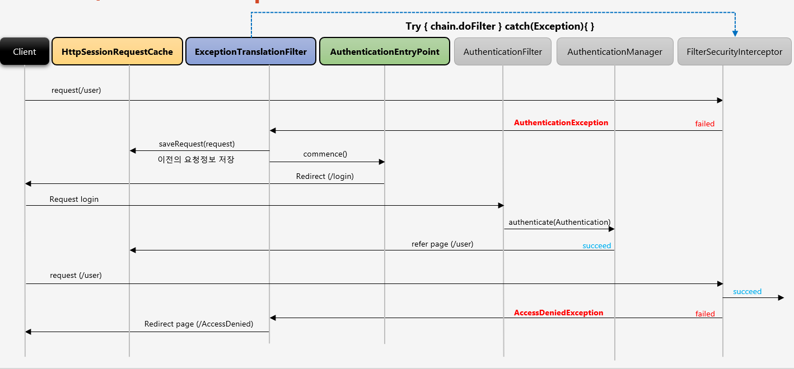
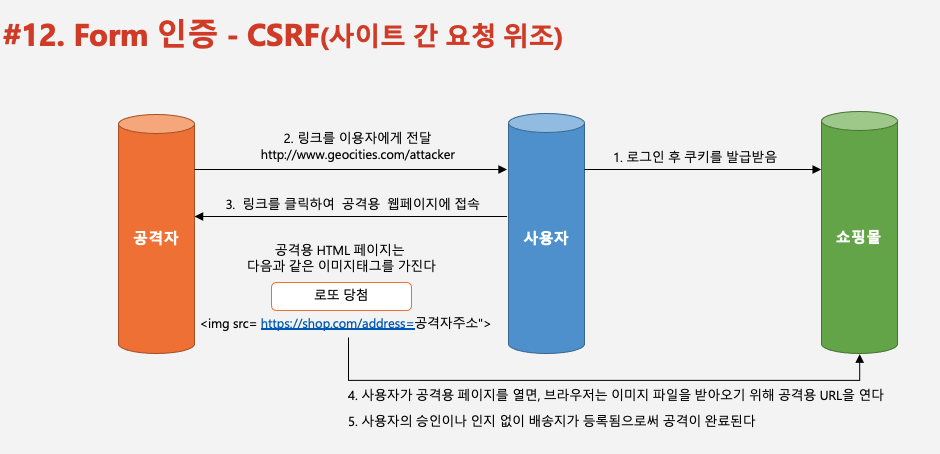

## 인증 API – AnonymousAuthenticationFilter ~ Form 인증 – CSRF, CsrfFilter 정리

# 인증 API – AnonymousAuthenticationFilter

- 익명객체

  - 인증객체가 없는 사용자
  - 인증된 사용자와 구분하기 위함
  - **익명 사용자일 경우에 처리 로직을 동작시키기 위해 익명사용자 인증 필터와 인증 객체 필요**

- **AnonymousAuthenticationFilter**
  - `isAnonymouse()`와 `isAuthenticated()`로 구분(return boolean)
  - 세션에 저장X


- **인증 객체가 없는** 클라이언트가 특정 자원 접근 시도
- `AnonymousAuthenticationFilter`로 인증 객체 검사
  - session에 인증객체가 있는 경우(인증된 사용자)
    - 해당 객체를 가지고 다음필터 동작(`Chain.doFilter`)
  - 인증객체가 없는 경우 - `익명사용자용 인증객체(AnonymousAuthenticationToken)` 생성 - SecurityContext에 Authentication 저장 - SecurityContextHolder에 SecurityContext 저장

<br/>

# 인증 API – 동시 세션 제어 / 세션고정보호 / 세션 정책

- **세션 관리**
  - 인증 시 사용자의 세션정보를 `등록`, `조회`, `삭제` 등의 세션 이력 관리
- **동시적 세션 제어**
  - 하나의 사용자 계정에 동시 접속할 수 있는 세션의 개수 제어
- **세션 고정 보호**
  - 인증할 때마다 세션 쿠키 새로 발급
  - 공격자의 쿠키 조작 방지
- **세션 생성 정책**
  - `Always`, `if_required`, `Never`, `Stateless`

## 동시적 세션 제어



- 하나의 사용자 계정에 동시 접속할 수 있는 세션의 개수 제어
- **최대 세션 허용 개수를 초과하였을 경우의 처리 로직 2가지 전략**
  - `이전 사용자 세션 만료`
    - 새로운 로그인을 시도할 경우, **기존 사용자의 계정 세션 만료설정**
  - `현재 사용자 인증 실패`
    - 새로운 로그인을 시도할 경우, **새로운 로그인 시도 인증 예외 발생**

### 동시적 세션 제어 설정

```java
@Configuration
@EnableWebSecurity
public class SecurityConfig extends WebSecurityConfigurerAdapter {
    @Autowired
    UserDetailsService userDetailsService;

    @Override
    protected void configure(HttpSecurity http) throws Exception {
        http
            .sessionManagement() //세션 관리 기능 작동
            .invalidSessionUrl("/invalid")//유효하지 않은 세션일 경우 이동 페이지
            .maximumSessions(1)//최대 허용 가능 세션 수, (-1: 무제한)
            .maxSessionsPreventsLogin(true)//동시 로그인 차단, false: 기존 세션 만료(default)
            .expiredUrl("/expired");//만료된 세션이 이동 페이지
		}
}
```

## 세션 고정 보호



- 해커가 사이트에 접속하여 JSSEIONID발급
- 사용자에게 해커가 발급받은 세션쿠키(JSSEIONID)를 심음
- 사용자가 세션쿠키로 로그인을 시도할 경우,
  해커의 세션쿠키가 심어져있기 때문에 해커와 **사용자정보 공유**

### 세션 고정 보호 설정

```java
@Configuration
@EnableWebSecurity
public class SecurityConfig extends WebSecurityConfigurerAdapter {
    @Override
    protected void configure(HttpSecurity http) throws Exception {

        http
            .sessionManagement()
            .sessionFixation()
            .changeSessionId();// servlet 3.1이상 기본 값
            // changeSessionId : 세션은 유지하되 세션아이디는 계속 새로 발급
            // none, migrateSession, newSession로 설정 변경 가능
		}
}
```

- **해커의 세션 고정 공격을 막기위한 대응 전략**
- `SessionManagementConfigure`의 내부 클래스 `SessionFixationConfigurer`에 정의
  - `none()`
    - 새로운 세션을 생성하지 않음
    - 세션 고정 공격에 취약
  - `migrateSession()`
    - 새로운 세션, 세션 아이디 발급
    - 이전 세션의 속성값 유지O
  - `newSession()`
    - 새로운 세션, 세션 아이디 발급
    - 이전 세션 속성값 유지X

```java
public final class SessionFixationConfigurer {

	/**
	 * Specifies that a new session should be created, but the session attributes from
	 * the original {@link HttpSession} should not be retained.
	 * @return the {@link SessionManagementConfigurer} for further customizations
	 */
	public SessionManagementConfigurer<H> newSession() {
		SessionFixationProtectionStrategy sessionFixationProtectionStrategy = new SessionFixationProtectionStrategy();
		sessionFixationProtectionStrategy.setMigrateSessionAttributes(false);
		setSessionFixationAuthenticationStrategy(sessionFixationProtectionStrategy);
		return SessionManagementConfigurer.this;
	}

	/**
	 * Specifies that a new session should be created and the session attributes from
	 * the original {@link HttpSession} should be retained.
	 * @return the {@link SessionManagementConfigurer} for further customizations
	 */
	public SessionManagementConfigurer<H> migrateSession() {
		setSessionFixationAuthenticationStrategy(new SessionFixationProtectionStrategy());
		return SessionManagementConfigurer.this;
	}

	/**
	 * Specifies that the Servlet container-provided session fixation protection
	 * should be used. When a session authenticates, the Servlet method
	 * {@code HttpServletRequest#changeSessionId()} is called to change the session ID
	 * and retain all session attributes.
	 * @return the {@link SessionManagementConfigurer} for further customizations
	 */
	public SessionManagementConfigurer<H> changeSessionId() {
		setSessionFixationAuthenticationStrategy(new ChangeSessionIdAuthenticationStrategy());
		return SessionManagementConfigurer.this;
	}

	/**
	 * Specifies that no session fixation protection should be enabled. This may be
	 * useful when utilizing other mechanisms for protecting against session fixation.
	 * For example, if application container session fixation protection is already in
	 * use. Otherwise, this option is not recommended.
	 * @return the {@link SessionManagementConfigurer} for further customizations
	 */
	public SessionManagementConfigurer<H> none() {
		setSessionFixationAuthenticationStrategy(new NullAuthenticatedSessionStrategy());
		return SessionManagementConfigurer.this;
	}

}
```

<br/>

## 세션 정책

- 스프링시큐리티가 아닌 `외부 서비스의 인증토큰 발급하는 방식`을 사용할 경우, 세션 생성 정책 설정 가능

### 세션 정책 설정

```java
@Configuration
@EnableWebSecurity
public class SecurityConfig extends WebSecurityConfigurerAdapter {
    @Autowired
    UserDetailsService userDetailsService;

    @Override
    protected void configure(HttpSecurity http) throws Exception {

        http
            .sessionManagement()
            .sessionCreationPolicy(SessionCreationPolicy.IF_REQUIRED);
		}
}
```

- `SessionCreationPolicy.Always`
- 스프링 시큐리티가 항상 세션 생성
- `SessionCreationPolicy.IF_REQUIRED`
  - 스프링 시큐리티가 필요 시 생성(default)
- `SessionCreationPolicy.Never`
  - 스프링 시큐리티가 생성X, 이미 존재하면 사용
- `SessionCreationPolicy.Stateless`
  - 스프링 시큐리티가 생성X, 존재해도 사용X
  - 세션, 쿠키로 인증하지 방식이 아닐 경우 사용
    - `JWT 토큰방식` 사용시 사용

```java
/**
 * Specifies the various session creation policies for Spring Security.
 *
 * @author Luke Taylor
 * @since 3.1
 */
public enum SessionCreationPolicy {

	/**
	 * Always create an {@link HttpSession}
	 */
	ALWAYS,

	/**
	 * Spring Security will never create an {@link HttpSession}, but will use the
	 * {@link HttpSession} if it already exists
	 */
	NEVER,

	/**
	 * Spring Security will only create an {@link HttpSession} if required
	 */
	IF_REQUIRED,

	/**
	 * Spring Security will never create an {@link HttpSession} and it will never use it
	 * to obtain the {@link SecurityContext}
	 */
	STATELESS

}
```

<br/>

# 인증 API – SessionManagementFilter, ConcurrentSessionFilter

- **SessionManagementFilter**
  - 세션 관리
  - 동시적 세션 제어
  - 세션 고정 보호
  - 세션 생성 정책
- **ConcurrentSessionFilter**
  - 매 요청마다 사용자의 현재 세션 만료 여부 체크
  - 세션이 만료되었을 경우, 즉시 만료 처리
  - `session.isExired() == true`
    - 로그아웃 처리
    - 즉시 오류 페이지 응답



- **기존 세션 만료**(default)로 설정된 sessionManagement()일 경우
  - 새로운 사용자가 로그인 시도시 `SessionManagementFilter`가 이전 사용자 세션 만료
  - 이전 사용자가 자원에 접근할 경우 `ConcurrentSessionFilter`가 세션 만료 체크(`session.isExpired()`)
    - 만료된 경우 이전 사용자 로그아웃, 오류페이지 응답

<br/>



**두 명의 사용자(user1, user2)가 로그인을 시도, 세션 갯수는 0인 상황**

1. user1 로그인 시도
   - `ConcurrentSessionControlAuthenticationStrategy`
     - 동시적 세션처리 클래스
     - 최대 세션 허용 갯수 확인(이 상황에서는 1개라 가정)
   - `ChangeSessionIdAuthenticationStrategy `
     - 세션 고정 보호 처리 클래스
     - default설정인 `changeSessionId()`로 세션 아이디 변경
   - `RegisterSessionAuthenticationStrategy`
     - 사용자 세션 정보 등록, 저장 클래스
     - 세션 정보 등록
   - user1 로그인 성공
2. user2 로그인 시도
   - **인증 실패 전략**
     - `ConcurrentSessionControlAuthenticationStrategy`
     - 최대 세션 허용 갯수 초과
     - 인증실패 `SessionAuthenticationException` 호출
   - user2 로그인 실패
   - **세션 만료 전략**
     - `ConcurrentSessionControlAuthenticationStrategy`
       - 최대 세션 허용 갯수 초과
       - 이전 사용자(user1) 세션 만료, `session.expireNow()
     - 세션 고정 보호, 세션정보 등록
     - **user1 자원 접근 시도**
       - `ConcurrentSessionFilter` 세션 만료 체크(`session.isExpired()`)
       - user1 로그아웃, 오류페이지 응답

<br/>

# 인가 API – 권한 설정 및 표현식

- **선언적 방식**
  - URL
    - http.antMatchers("/users/\*\*").hasRole("USER")
  - Method
    - @PreAuthorize("hasRole('USRE')")
    - public void user(){System.out.println("user")}
- **동적 방식 - DB 연동 프로그래밍**
  - URL
  - Method



```java
@Override
protected void configure(HttpSecurity http) throws Exception {
    //인가정책
    http
            .antMatcher("/shop/**")
            .authorizeRequests()
            .antMatchers("/shop/login", "/shop/users/**").permitAll()
            .antMatchers("/shop/user").hasRole("USER")
            .antMatchers("/shop/admin/pay").hasRole("ADMIN") // 1
            .antMatchers("/shop/admin/**").access("hasRole('ADMIN') or hasRole('SYS')") // 2
            .anyRequest().authenticated();
}
```

### 주의

:heavy_exclamation_mark: 인가 설정 시에는 구체적인 경로 -> 큰 범위의 경로가 뒤에 와야함

- 순서가 1 -> 2일 경우
  - `/shop/admin/pay`는 ADMIN권한의 사용자만 접근가능
- 순서가 2 -> 1일 경우
  - `/shop/admin/pay`는 ADMIN,SYS 사용자 모두 접근가능

### 임의로 메모리방식으로 사용자 생성, 권한 설정

```java
@Override
protected void configure(AuthenticationManagerBuilder auth) throws Exception {
    auth.inMemoryAuthentication().withUser("user").password("{noop}1111").roles("USER");
    auth.inMemoryAuthentication().withUser("sys").password("{noop}1111").roles("SYS");
    auth.inMemoryAuthentication().withUser("admin").password("{noop}1111").roles("ADMIN");
}
```

- `{noop}`
  - 비밀번호 암호화 방식
  - noop은 암호화없이 문자열 그대로 비밀번호에 입력된다는 의미

<br/>

# 인증/인가 API – ExceptionTranslationFilter, RequestCacheAwareFilter



- `FilterSecurityInterceptor`
  - 인가처리를 하는 필터
  - SpringSecurity의 필터 중에서 맨 마지막에 위치
- `ExceptionTranslationFilter`
  - 자원 접근시 인증 및 인가 예외를 처리하는 필터
  - SpringSecurity의 마지막에서 두 번째 필터
  - try-catch문으로 `FilterSecurityInterceptor`필터에서 발생한 예외를 처리
    - `AuthenticationException`
      - **인증 예외 처리**
      - `AuthenticationEntryPoint` 호출
        - 로그인 페이지 이동, 401(Unauthorized) 오류 코드 전달 등
      - `인증 예외 발생 전 요청정보 저장`
        - **RequestCache**
          - 인터페이스
          - 기본 구현체는 `HttpSessionRequestCache`
          - `DefaultSavedRequest`객체를 세션에 저장하는 역할
        - **SavedRequest**
          - 인터페이스
          - 기본 구현체는 `DefaultSavedRequest`
          - 현재 클라이언트의 요청과정 중에 포함된 쿠키, 헤더, 파라미터 값들을 추출하여 보관하는 역할
    - **현재 클라이언트의 요청 과정에서 생성되거나 참조되는 모든 정보는 DefaultSavedRequest에 저장되고 이 객체는 HttpSessionRequestCache에 의해 세션에 저장**
    - `AccessDeniedException`
      - **인가 예외 처리**



```java
@Override
protected void configure(HttpSecurity http) throws Exception {

// 인증이 되어있지 않은 상태에서 mypage를 들어가면 로그인 페이지를 보여주고
// 로그인하면 이전 mypage를 들어가려고 했던 요청주소로 바로 이동하는 로직 가능
    http
        .formLogin()
        .successHandler(new AuthenticationSuccessHandler() {
            @Override
            public void onAuthenticationSuccess(HttpServletRequest request, HttpServletResponse response, Authentication authentication) throws IOException, ServletException {
              HttpSessionRequestCache cache = new HttpSessionRequestCache();
              DefaultSavedRequest savedRequest = cache.getRequest(); // 세션에 저장된 DefaultSavedRequest 를 가져옴
              response.sendRedirct(savedRequest.setRequestURL()); // 이전의 주소정보를 얻어와서 리다이렉트 시킴
            }
        });

    http
        .exceptionHandling()
        .authenticationEntryPoint(new AuthenticationEntryPoint() { //인증 실패 처리
            @Override
            public void commence(HttpServletRequest request, HttpServletResponse response, AuthenticationException authException) throws IOException, ServletException {
                response.sendRedirect("/login"); // 사용자 정의 페이지
            }
        })
        .accessDeniedHandler(new AccessDeniedHandler() { //인가 실패 처리
            @Override
            public void handle(HttpServletRequest request, HttpServletResponse response, AccessDeniedException accessDeniedException) throws IOException, ServletException {
                response.sendRedirect("denied");
            }
        });
}
```

**1. 클라이언트가 로그인 과정을 거치지 않고 어떤 자원에 접근할 경우, 그리고 그 자원에 접근하기 위해서는 반드시 인증을 필요로 하는 경우**

- 현재 클라이언트가 인증을 받지 않은 상태로 자원에 접근
- `FilterSecurityInterceptor`는 인가 예외 발생
- `ExceptionTranslationFilter`가 예외 처리

```java
protected void sendStartAuthentication(HttpServletRequest request,
      HttpServletResponse response, FilterChain chain,
      AuthenticationException reason) throws ServletException, IOException {
   // SEC-112: Clear the SecurityContextHolder's Authentication, as the
   // existing Authentication is no longer considered valid
   SecurityContextHolder.getContext().setAuthentication(null);
   requestCache.saveRequest(request, response);
   logger.debug("Calling Authentication entry point.");
   authenticationEntryPoint.commence(request, response, reason);
}
```

- 현재 클라이언트가 접근하고자 했던 자원의 주소 정보, 헤더값, 쿠키 값들을 담고 있는 request 객체를 `HttpSessionRequestCache` 가 저장

```java
requestCache.saveRequest(request, response);
```

- `DefaultSavedRequest`를 생성하여 클라이언트의 요청객체인 request 를 생성자에 저장하고 있고
  DefaultSavedRequest 객체를 세션에 저장

```java
public void saveRequest(HttpServletRequest request, HttpServletResponse response) {
   if (requestMatcher.matches(request)) {
      DefaultSavedRequest savedRequest = new DefaultSavedRequest(request,
            portResolver);

      if (createSessionAllowed || request.getSession(false) != null) {
         // Store the HTTP request itself. Used by
         // AbstractAuthenticationProcessingFilter
         // for redirection after successful authentication (SEC-29)
         request.getSession().setAttribute(this.sessionAttrName, savedRequest);
         logger.debug("DefaultSavedRequest added to Session: " + savedRequest);
      }
   }
   else {
      logger.debug("Request not saved as configured RequestMatcher did not match");
   }
}
```

- 클라이언트는 다시 로그인 페이지로 이동

```java
authenticationEntryPoint.commence(request, response, reason);
```

<hr/>

**2. 이후에 클라이언트가 1.에서 ExceptionTranslationFilter 에 의해 이동된 로그인 페이지에서 인증을 하고 인증에 성공하는 경우**

```java
HttpSessionRequestCache cache = new HttpSessionRequestCache();
DefaultSavedRequest savedRequest = cache.getRequest(); // 세션에 저장된 DefaultSavedRequest 를 가져옴
response.sendRedirct(savedRequest.setRequestURL()); // 이전의 주소정보를 얻어와서 리다이렉트 시킴
```

- 인증 처리를 하는 인증 필터에서는 인증에 성공한 이후 처리를 진행 하는 과정에서 `HttpSessionRequestCache` 클래스를 참조
- 세션에 저장되어 있는 `DefaultSavedRequest` 를 얻어오고 클라이언트가 로그인 과정 이전 즉 처음에 접근하고자 했던 자원주소정보를 이 객체로부터 추출하여 그 페이지로 이동

<hr/>

**클라이언트가 인증 과정 없이 어떤 자원에 접근하다가 예외가 발생해서 로그인 하는 경우가 아닌 처음부터 로그인을 시도하다가 인증 예외가 발생할 경우**

- FilterSecurityInterceptor 및 ExceptionTranslationFilter 와는 아무런 상관이 없이 발생한 예외
  - HttpSessionRequestCache 및 DefaultSavedRequest 와 연계된 작업실행X

<br/>

# Form 인증 – CSRF, CsrfFilter



### CSRF(Cross Site Request Forgery)

- 사용자가 로그인 이후에 세션과 쿠키를 발급받음
  - 사용자의 인증쿠키가 사용자의 브라우저에 저장이 되어있는 상태
- 공격자가 사용자 이메일로 링크를 전달
- 사용자가 링크를 클릭하여 공격용 웹페이지에 접속하게 되면 그 페이지에는 img 태그가 width height 0으로 src를 쇼핑몰의 링크로 대체
- `사용자의 의도와는 무관하게 공격자가 심어놓은 특정 방식을 통해 자원 요청, 이에 대한 응답을 받을 수 있도록 하는 것`

### CsrfFilter

- 모든 요청에 랜덤하게 생성된 토큰을 HTTP 파라미터로 요구
- 요청 시 전달되는 토큰 값과 서버에 저장된 실제 값과 비교한 후 만약 일치하지 않으면 요청은 실패한다.
- **Client**

  ```java
  <input type="hidden" name="${csrf.parameterName}" value="${_csrf.token}"/>
  ```

  - HTTP 메소드
    - PATCH, POST, PUT, DELETE

- **Spring Security**
  - http.csrf(): 기본 활성화되어 있음
  - http.csrf().disabled(): 비활성화

:heavy_exclamation_mark:

```
링크 클릭 == 사용자로 하여금 공격자가 유인한 사이트에서 실행

즉 공격자는 사용자가 이용하는 서비스의 URL 값을 자신이 만든 사이트에 심어 놓고 사용자가 링크를 클릭하게 하여 실제 사용자의 서비스에 접속

사용자는 이미 로그인이 되어 있기 때문에 세션 쿠키가 만들어진 상태
공격자가 심어 놓은 URL의 액션을 실행할 경우, 사용자의 서비스 시스템은 정상적인 사용자의 액션으로 판단

서비스가 해당 액션에 대해 csrf 토큰값을 요구할 경우 공격자의 사이트에는 서비스에서 사용자에게 발행한 csrf 토큰값을 알수가 없기 때문에 접근 거부
```
