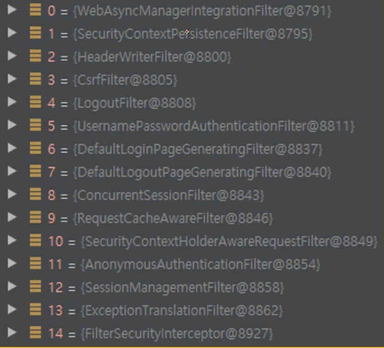
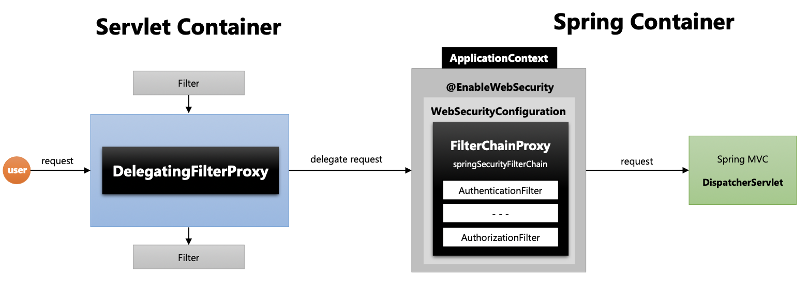
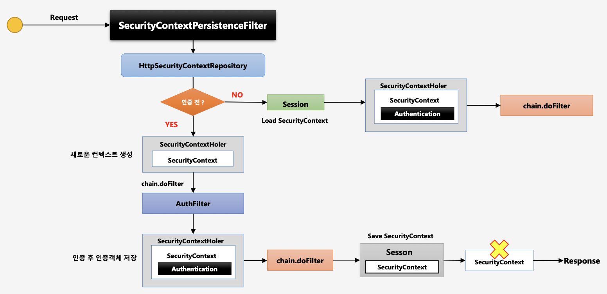
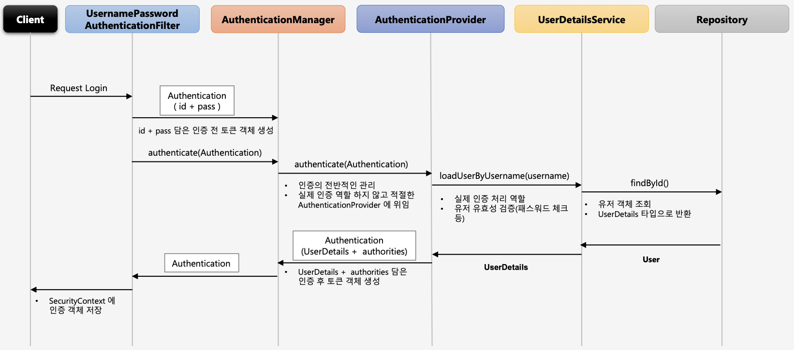
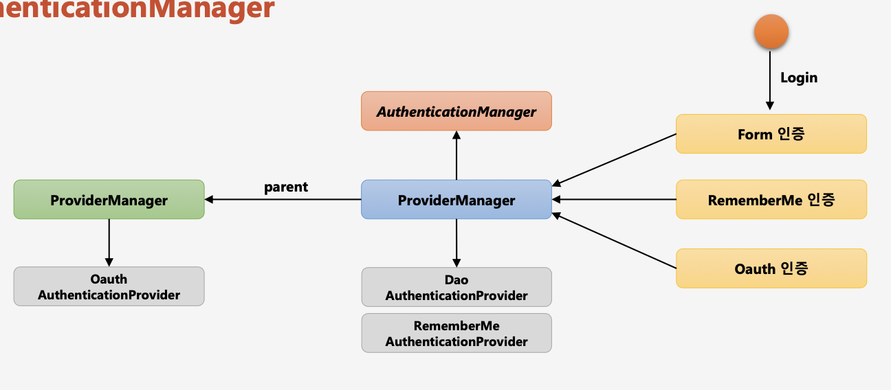
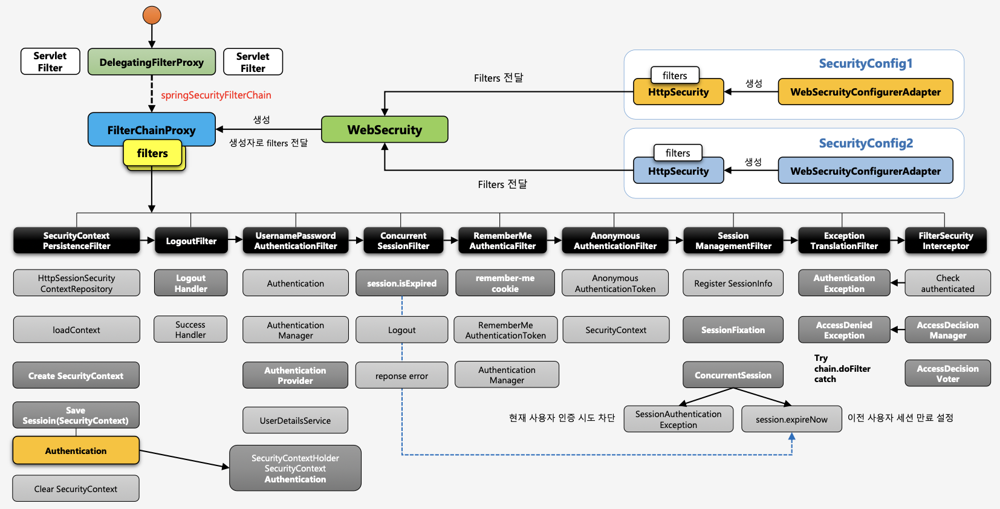

# 섹션 2. 스프링 시큐리티 주요 아키텍처 이해
## 1) 위임 필터 및 필터 빈 초기화
### 1. DelegatingFilterProxy
1. 서블릿 필터는 스프링에서 정의된 빈을 주입해서 사용할 수 없다.
2. 특정한 이름을 가진 스프링 빈을 찾아 그 빈에게 요청을 위임
	- springSecurityFilterChain 이름으로 생성된 빈을 ApplicationContext에서 찾아 요청을 위임
	- 실제 보안처리를 하지 않음
`DelegetingFilterProxy -(요청 위임)-> SpringBean -> ServletFilter`

### 2.Filter Chain Proxy


1. springSecurityFilterChain 의 이름으로 생성되는 필터 빈
2. DelegatingFilterProxy 으로 부터 요청을 위임 받고 실제 보안 처리
3. 스프링 시큐리티 초기화 시 생성되는 필터들을 관리하고 제어
	- 스프링 시큐리티가 기본적으로 생성하는 필터
	- 설정 클래스에서 API 추가 시 생성되는 필터
4. 사용자의 요청을 필터 순서대로 호출하여 전달
5. 사용자정의 필터를 생성해서 기존의 필터 전.후로 추가 가능
	- 필터의 순서를 잘 정의
6. 마지막 필터까지 인증 및 인가 예외가 발생하지 않으면 보안 통과



> 유저의 리퀘스트가 `Servlet Container`로 먼저 들어온다.
> 각각의 필터가 처리되면서, `DelegatingFilterProxy`로 요청이 간다.
>  위 프록시는 `"springSecurityFilterChain"`이라는 이름을 찾는다. 이 이름을 가진 Bean은 `FilterChainProxy`이다.
>   찾고나면 요청을 위임한다.
>   `FilterChainProxy`로 들어온 요청을 체인된 순서대로 필터 처리한다.
>   처리가 마무리 된 요청을 `Spring MVC`의 `디스패처서블릿`으로 보낸다. 

## 2) 필터 초기화와 다중 보안 설정
다중으로 WebSecurityConfigurerAdapter를 만드는 법
- 설정 클래스 별로 보안 기능이 각각 작동
- 설정 클래스 별로 RequestMatcher 설정
	- `http.antMatch("/admin/**")`
- 설정 클래스 별로 필터가 생성
- FilterChainProxy가 각 필터들을 가지고 있음
- 요청에 따라 RequestMatcher와 매칭되는 필터가 작동하도록 함

```java
// SecurityConfig.java

@Configuration  
@EnableWebSecurity  
@Order(0) // 더 작은 범위가 먼저 검사되도록
public class SecurityConfig extends WebSecurityConfigurerAdapter {  
  
    public void configure(HttpSecurity http) throws Exception {  
        http  
                .antMatcher("/admin/**")  
                .authorizeRequests()  
                .anyRequest().authenticated()  
        .and()  
                .httpBasic();  
    }  
}  
  
@Configuration  
@Order(1)  
class SecurityConfig2 extends WebSecurityConfigurerAdapter {  
  
    public void configure(HttpSecurity http) throws Exception {  
        http  
                .authorizeRequests()  
                .anyRequest().permitAll()  
        .and()  
                .formLogin();  
    }  
}
```

> 설정 클래스로 인해 생긴 여러 SecurityFilterChain은
> FilterChainProxy 내부의 SecurityFilterChain에 모두 들어간다.
> FilterChainProxy는 요청이 들어올 때 알맞은 필터를 선택한다.
>  여러 클래스의 순서는 `@Order(우선순위)`로 지정해 줄 수 있다.
>  첫 번째 클래스가 매치되는지 검사하는 메서드에서 false를 반환하면 다음 우선순위의 클래스로 가는 방식

## 3) 인증 개념 이해 - Authentication
### Authentication - 인증 주체
- 당신이 누구인지 증명하는 것
- 사용자의 인증 정보를 저장하는 토큰 개념
- 인증 시 id 와 password를 담고 인증 검증을 위해 전달되어 사용된다.
- 인증 후 최종 인증 결과(user 객체, 권한정보)를 담고 SecurityContext에 저장되어 전역적으로 참조가 가능하다.
	- `Authentication authentication = SecurityContextHolder.getContext().getAuthentication()`
- 구조
1) principal : 사용자 아이디 혹은 User객체를 저장
2) credentials : 사용자 비밀번호
3) authorities : 인증된 사용자의 권한 목록
4) details : 인증 부가 정보
5) Authenticated : 인증 여부

```java
// AbstractUserDetailsAuthenticationProvider.class
protected Authentication createSuccessAuthentication(Object principal, Authentication authentication, UserDetails user) {  
    UsernamePasswordAuthenticationToken result = UsernamePasswordAuthenticationToken.authenticated(principal, authentication.getCredentials(), this.authoritiesMapper.mapAuthorities(user.getAuthorities()));  
    result.setDetails(authentication.getDetails());  
    this.logger.debug("Authenticated user");  
    return result;  
}

// UsernamePasswordAuthenticationToken.class
// 첫 번째 생성자는 로그인 당시 입력했던 id, pw 정보를 전달 받는다.
public UsernamePasswordAuthenticationToken(Object principal, Object credentials) {  
    super((Collection)null);  
    this.principal = principal;  
    this.credentials = credentials;  
    this.setAuthenticated(false);  
}  

// 두 번째 생성자는 인증에 성공한 후 권한을 추가적으로 받는다
public UsernamePasswordAuthenticationToken(Object principal, Object credentials, Collection<? extends GrantedAuthority> authorities) {  
    super(authorities);  
    this.principal = principal;  
    this.credentials = credentials;  
    super.setAuthenticated(true);  
}
```

1. 리퀘스트 로그인 : username + password
2. `UsernamePasswordAuthenticationFilter`를 거침
3. Authentication 객체를 만든다 (username, password를 이용하여)
4. `AuthenticationManager`를 거침
5. Authentication 객체를 같은 클래스로 만들어서 최종 인증 결과를 저장한다.
6.  `SerucirtyContextHolder` 내부의 `SecurityContexx`에
   Authentication 객체를 저장하여 인증 객체를 전역적으로 사용한다.


## 4) 인증 저장소 - SecurityContextHolder, SecurityContext
### SecurityContext
- Authentication 객체가 저장되는 보관소. 필요 시 언제든지 Authentication 객체를 꺼내어 쓸 수 있다.
- ThreadLocal에 저장되어 아무 곳에서나 참조가 가능하도록 설계함
### SecurityContextHolder
- SecurityContext 객체 저장 방식
	- MODE_THREADLOCAL : 스레드 당 SecurityContext 객체를 할당, 기본 값
	- MODE_INHERITABLETHREADLOCAL : 메인 스레드와 자식 스레드에 관하여 동일한 SecurityContext를 유지
	- MODE_GLOBAL : 응용 프로그램에서 단 하나의 SecurityContext를 저장한다.
- SecurityContextHolder.clearContext() : 기존 SecurityContext 정보 초기화
	- 인증 실패 시 호출된다.

```java
@RestController  
public class SecurityController {  
  
    @GetMapping("/")  
    public String index(HttpSession session) {  
        Authentication authentication = SecurityContextHolder.getContext().getAuthentication();  
        System.out.println(authentication);  
        SecurityContext context = (SecurityContext) session.getAttribute(HttpSessionSecurityContextRepository.SPRING_SECURITY_CONTEXT_KEY);  
        Authentication authentication1 = context.getAuthentication();  
        System.out.println(authentication1);  
  
        return "home";  
    }  
    // 위에서 SecurityContextHolder에서 Authentication를 가져올 때와
    // session에서 Authentication를 가져올 때 같은 Authentication를 갖는다.
  
    @GetMapping("/thread")  
    public String admin() {  
        new Thread(  
                new Runnable() {  
                    @Override  
                    public void run() {  
                        Authentication authentication = SecurityContextHolder.getContext().getAuthentication();  
                        System.out.println(authentication);  
                        // null을 갖는다.
                        // **새로운 자식 Thread를 만든 것이기 때문!!!**                     
                    }  
                }  
        ).start();  
  
        return "admin";  
    }  
}
```
***위와 같은 코드에서 새로운  자식 Thread를 만들더라도 null이 뜨지 않게 하려면
`SecurityContextHolder.setStrategyName(SecurityContextHolder.MODE_INHERITABLETHREADLOCAL);`
코드를 SecurityConfig::configure() 메서드 내부에 설정해 주면 된다!***


## 5) 인증 저장소 필터 - SecurityContextPersistenceFilter
### SecurityContextPersistenceFilter
- SecurityContext 객체의 **생성, 저장 조회**
- 익명 사용자
	- 새로운 SecurityContext 객체를 생성하여 SecurityContextHolder에 저장
	- AnonymouseAuthenticationFilter 에서 AnonymouseAuthenticationToken 객체를 SecurityContext에 저장
- 인증 시
	- 새로운 SecurityContext 객체를 생성하여 SecurityContextHolder에 저장
	- UsernamePasswordAuthenticationFilter 에서 인증 성공 후 SecurityContext에 UsernamePasswordAuthentication 객체를 SecurityContext에 저장
	- 인증이 최종 완료되면 Session에 SecurityContext를 저장
- 인증 후
	- Session 에서 SecurityContext 꺼내어 SecurityContextHolder 에서 저장
	- SecurityContext 안에 Authentication 객체가 존재하면 계속 인증을 유지한다.
- 최종 응답 시 공통
	- SecurityContextHolder.clearContext()


- 사용자의 매 요청마다 필터에 들어간다. (인증여부 상관 x)
- 인증 전
	- 새로운 컨텍스트 생성하여 SecurityContextHolder에 저장
	- 인증 필터
	- 인증 후 인증객체 Authentication를 SecurityContext 내부에 저장
	- 다음 필터로 인동
	- 클라이언트에 응답할 때 Session에 SecurityContext 저장
	- SecurityContextHolder 내부의 SecurityContext 제거(??)
- 인증 후
	- 세션에서 SecurityContext 를 꺼내어 SecurityContextHolder에 저장한다.
	- 다음 필터로 이동
		- 별도의 AuthFilter 등을 거쳐 인증을 새로 진행할 필요가 없다.

## 6) 인증 흐름 이해 - Authentication Flow


## 7) 인증 관리자 - AuthenticationManager

- AuthenticationManager : AuthenticationProvider 목록 중에서 인증 처리 요건에 맞는 AuthenticationProvider 를 찾아 인증 처리를 위임한다.
	- Form이면 DaoA.P를, RememberMe이면 RememberMeA.P를 찾아 위임하는 방식
- 부모 ProviderManager를 설정하여 AuthenticationProvider를 계속 탐색할 수  있다.

## 8) 인증 처리자 - AuthenticationProvider
- AuthenticationProvider는 Authentication을 받아 authenticate 진행
	- ID 검증 (실패 시 UserNotFoundException)
	- password 검증 (실패 시 BadCredentialException)
	- 추가 검증 (완료 시 AuthenticationManager로 Authentication을 보낸다)
- supports 메서드 : token 타입에 따라서 언제 provider를 사용할지 조건

## 9) 인가 개념 및 필터 이해 - Authorization, FilterSecurityInterceptor
### Authorization
- 스프링 시큐리티가 지원하는 권한 계층
- 웹 계층 : URL 요청에 따른 메뉴 혹은 화면 단위의 레벨 보안
- 서비스 계층 : 화면 단위가 아닌 메소드 같은 기능 단위의 레벨 보안
- 도메인 계층 : 객체 단위의 레벨 보안

### FilterSecurityInterceptor
- 마지막에 위치한 필터로써 인증된 사용자에 대하여 특정 요청의 승인/거부 여부를 최종적으로 결정
- 권한 제어 방식 중 HTTP 자원의 보안을 처리하는 필터
- 권한 처리를 AccessDecisionManager에게 맡김
<br>
- 인증객체 없이 보호자원에 접근을 시도할 경우 검사
	- FilterSecurityInterceptor에서 검사하여 인증객체가 null일 경우 ->AuthenticationException을 발생
- 사용자가 요청한 자원에 필요한 권한 정보를 조회해서 전달
	- 필요한 권한 정보가 있다면 다음 AccessDecisionManager에서 권한 검사
- 권한 검사 & 최종 심의 결정자 AccessDecisionManager 에서 AccessDecisionVoter로 심의 요청 후 결과 반환받음
	- 승인이 없다면 AccessDeniedException을 발생
- 위의 두 Exception은 ExceptionTranslationFilter가 받아서 다시 로그인 페이지로 보내는 등의 처리를 할 수 있게 한다.

```java
// SecurityConfig::configure() 메서드
public void configure(HttpSecurity http) throws Exception {  
    http  
            .authorizeRequests()  
            .antMatchers("/user").hasRole("USER") // 권한 설정
            .anyRequest().authenticated();  
    http  
            .formLogin();  
}
```
- 설정해 준 권한("USER")이 사용자에게 없다면 `도메인/user`에 접근 불가능

## 10) 인가 결정 심의자 - AccessDecisionManager, AccessDecisionVoter
### AccessDecisionManager
- 인증 정보, 요청 정보, 권한 정보 를 이용해서 사용자의 자원 접근을 허용할 것인지 거부할 것인지를 최종 결정하는 주체
- 여러 개의 Voter들을 가질 수 있으며 Voter들로부터 접근허용, 거부, 보류에 해당하는 각각의 값을 리턴받고 판단 및 결정
- 최종 접근 거부 시 예외 발생
<br>
- 접근 결정의 세 가지 유형
	- AffirmativeBased
		- 여러 개의 Voter 클래스 중 하나라도 접근 허가로 결론을 내면 접근 허가로 판단한다.
	- ConsensusBased
		- 다수 표(승인 및 거부)에 의해 최종 결정을 판단한다.
		- 동수일 경우 기본은 접근허가이나 allowIfEqualGrantedDeniedDecisions을 false로 설정할 경우 접근 거부로 결정된다.
	- UnanimousBased
		- 모든 보터가 만장일치로 접근을 승인해야 하며 그렇지 않은 경우 접근을 거부한다.

### AccessDecisionVoter
- 판단을 심사하는 것(위원)
- Voter가 권한 부여 과정에서 판단하는 자료
	- Authentication - 인증 정보 (`user`)
	- FilterInvocation - 요청 정보 (`antMatcher("/user")`)
	- ConfigAttributes - 권한 정보 (`hasRole("USER")`)
- 결정 방식
	- ACCESS_GRANTED : 접근 허용(1)
	- ACCESS_DENIED : 접근 거부 (-1)
	- ACCESS_ABSTAIN : 접근 보류(0)
		- 결정을 내릴 수 없는 경우

## 11) 스프링 시큐리티 필터 및 아키텍처 정리
