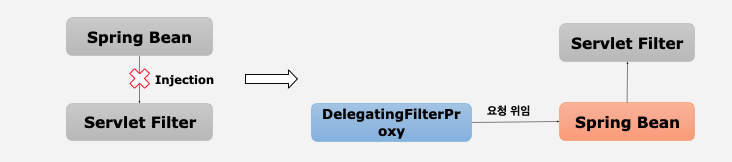
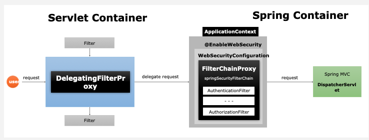
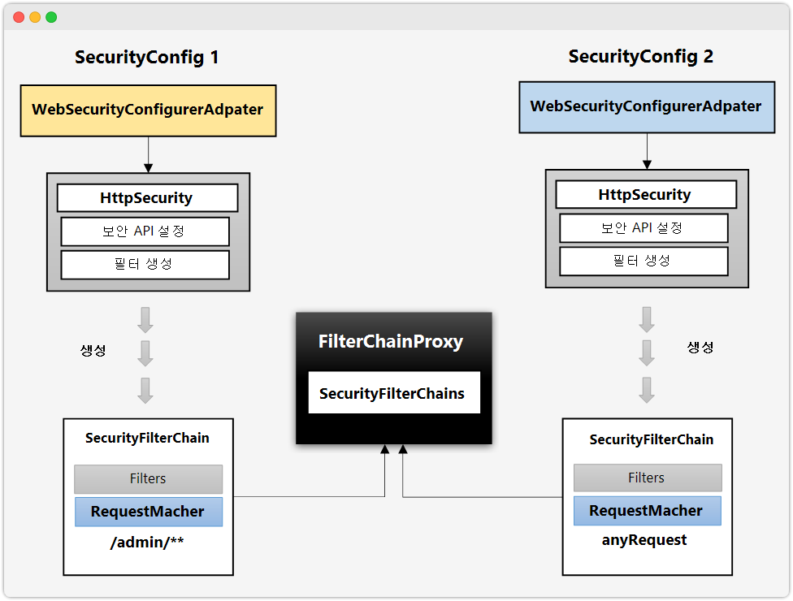
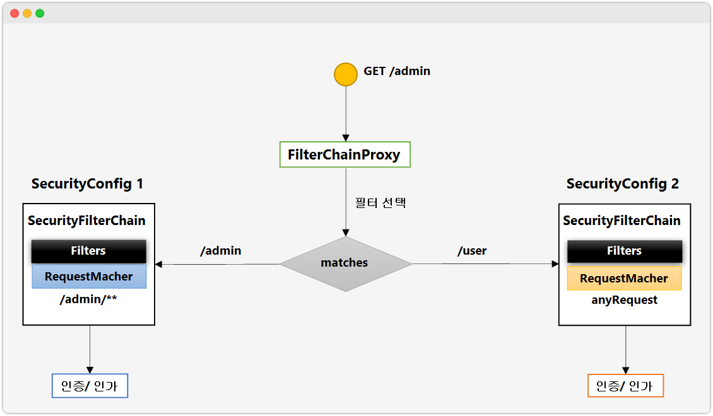
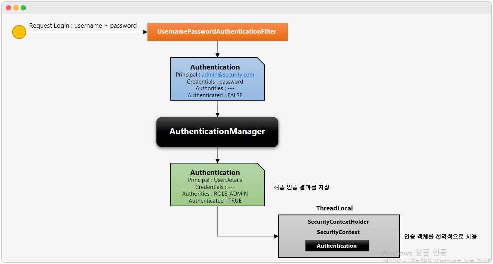
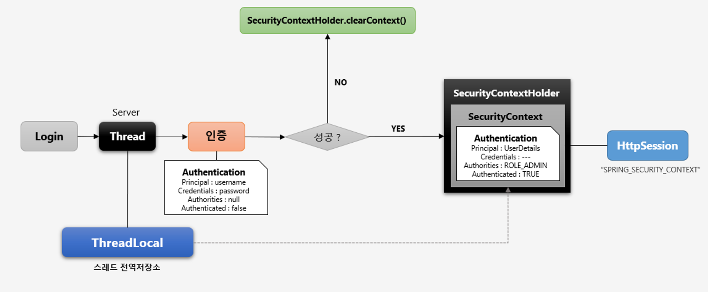

## DelegatingFilterProxy, FilterChainProxy ~ SecurityContextHolder, SecurityContext 정리

# DelegatingFilterProxy, FilterChainProxy

### 필터의 흐름

> HTTP요청 -> WAS -> 필터 -> 서블릿 -> 컨트롤러

### 필터 체인

> HTTP요청 -> WAS -> 필터1 -> 필터2 -> ... -> 서블릿 -> 컨트롤러

### DelegatingFilterProxy



- Servlet기반 필터는 Servlet 컨테이너에서만 생성/실행
- Spring Ioc컨테이너와 다르기 때문에 Spring Bean의 Injection 불가
- 스프링 시큐리티는 `DelegatingFilterProxy`을 통해 Servlet Filter의 요청을 스프링 컨테이너에 존재하는 빈(`springSecurityFilterChain`)을 Application
  Context에서 찾아 위임
- 보안처리X

> DelegatingFilterProxy는 Servlet 컨테이너와 Spring Ioc 컨테이너를 연결해주는 필터

### FilterChainProxy



- DelegatingFilterProxy의 요청을 받아 실제 보안처리하는 필터
- 실행 순서
  1. HTTP요청
  2. Servlet 컨테이너가 요청을 받음
  3. Servlet 필터 동작 중 DelegatingFilterProxy가 요청을 받음
  4. DelegatingFilterProxy는 Application Context 객체 내에 빈인 springSecurityFilterChain(`FilterChainProxy`)를 찾음
  5. FilterChainProxy Bean에 요청 전달
  6. FilterChainProxy 필터들로 보안처리 진행
  7. SpringMVC의 DispatcherServlet에 전달하여 Servlet 처리

<br/>

# 필터 초기화와 다중 보안 설정



- FilterChaingProxy는 springSecurityFilterChains을 통해 보안처리함
- 이러한 보안필터들은 스프링 시큐리티 설정 클래스마다 springSecurityFilterChain 하나씩 할당



1. GET방식으로  /admin 주소로 자원 요청
2. FilterChainProxy에서 요청을받아 요청을 처리할 필터를 선택
3. 요청 URL과 매칭되는 Filter 선택
   - FilterChainProxy가 지정하는 각각의 SecurityConfig 객체들에서 RequestMacher의 정보와 매치되는 정보를 찾음
4. 일치하는 객체의 필터를 수행하여 인증/인가 처리


```java
@Configuration
@EnableWebSecurity
@Order(0) // 구체적인 자원부터 필터링할 수 있도록 순서조정
public class SecurityConfig extends WebSecurityConfigurerAdapter {

    @Override
    protected void configure(HttpSecurity http) throws Exception {
        http
                .antMatcher("/admin/**")
                .authorizeRequests()
                .anyRequest().authenticated()
                .and()
                .httpBasic();

    }
}

@Configuration
@Order(1)
class SecurityConfig2 extends WebSecurityConfigurerAdapter{

    @Override
    protected void configure(HttpSecurity http) throws Exception {
        http
                .authorizeRequests()
                .anyRequest().permitAll()
                .and()
                .formLogin();

        SecurityContextHolder.setStrategyName(SecurityContextHolder.MODE_INHERITABLETHREADLOCAL);
    }
}
```

- 보안 설정을 여러 개의 설정으로 만들어 동시에 사용가능
- Order설정 시 유의 (구체적 -> 포괄적)
  - 접근권한 검사부분에서 좁은 범위부터 설정을 해야 하는 이유와 동일
- 설정클래스 별로 보안 기능 각각 작동
- 설정클래스 별로 RequestMatcher설정
- FilterChainProxy가 각 SecurityFilterChain리스트들을 가지고 있음
- RequestMatcher와 매칭되는 필터 작동

<br/>

# Authentication

- 서버에게 내가 누구인지 알려주는 과정
- 스프링 시큐리티는 내부적으로 인증정보를 `Token`개념 관리
  - `인증 전` 토큰 : id, 비밀번호 정보
  - `인증 후` 토큰 : User객체, 권한 정보
- SecurityContext에 저장되어 `전역적`으로 토큰 참조 가능

```java
SecurityContextHolder.getContext().getAuthentication();
```

### 토큰 내부

- **principal** : 사용자 아이디 혹은 User 객체 저장
- **credentials** : 사용자 비밀번호
- **authorities** : 인증 사용자의 권한 목록
- **details** : 인증 부가 정보
- **Authenticated** : 인증 여부(boolean)

### Flow



1. 사용자가 로그인을 시도(username + password 입력 및 전달)
2. `usernamePasswordAuthenticationFilter`(인증필터)가 요청정보를 받아서 정보 추출, 인증객체 (Authentication) 생성
3. `AuthenticationManager`가 인증객체로 인증처리
   - a. 인증이 실패시 예외 발생
4. 인증 성공 후 `Authentication` 인증객체를 만들어서 내부의 `Principal, Credentials, Authorities, Authenticated` 매칭
5. `SecurityContextHolder`객체 안의 `SecurityContext`에 저장
   - 인증객체를 전역적으로 참조 가능

# SecurityContextHolder, SecurityContext

## SecurityContext

- Authentication 객체 보관소
- ThreadLocal에 저장되어 전역적으로 참조 가능
  - ThreadLocal : Thread별로 할당된 고유 공간
    - 다른 Thread와 공유X
    - get, set, remove api 존재
    - ThreadLocal 내에서는 참조가능
- 인증 완료시 `HttpSession`에 저장되어 어플리케이션 영역으로 참조 가능

## SecurityContextHolder

- SecurityContext 객체를 저장하는 wrapper 클래스
- SecurityContext 저장 방식
  - **MODE_THREADLOCAL** : 스레드당 SecurityContext객체 할당(default)
  - **MODE_INHERITABLETHREADLOCAL** : 메인 스레드와 자식 스레드에 관하여 동일한 SecurityContext 유지
  - **MODE_GLOBAL** : 어플리케이션에서 단 하나의 SecurityContext 저장

```java
Authentication authentication = SecurityContextHolder.getContext().getAuthentication()
```

- 인증객체 전역적으로 참조 가능

### Flow



1. 사용자 로그인 시도
2. Server가 요청을 받아서 Thread 생성 (ThreadLocal 할당)
3. thread가 인증 처리 시도
   - 인증 객체(Authentication) 생성 
     - **인증 실패**시 SecurityContextHolder.clearContext() 인증객체 초기화
     - **인증 성공**시 SecurityContextHolder안의 SecurityContext에 인증객체(Authentication)저장
       - ThreadLocal에 SecurityContextHolder가 있음
4. SecurityContext에서 최종적으로 HttpSession에 저장
   - SPRING_SECURITY_CONTEXT로 저장)