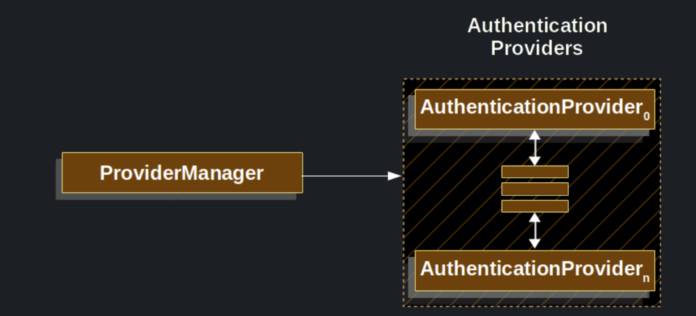
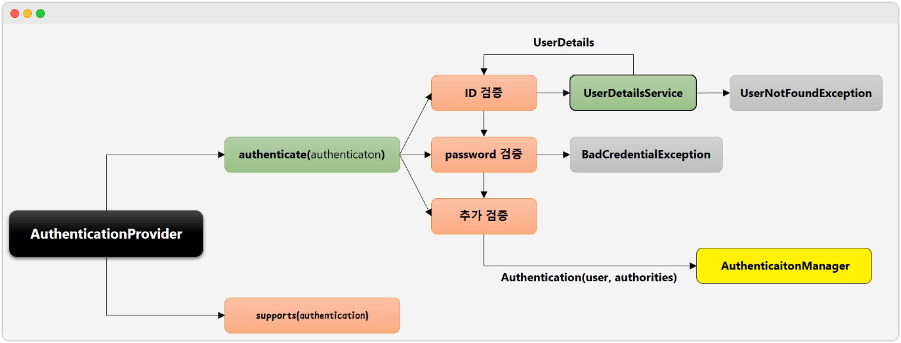
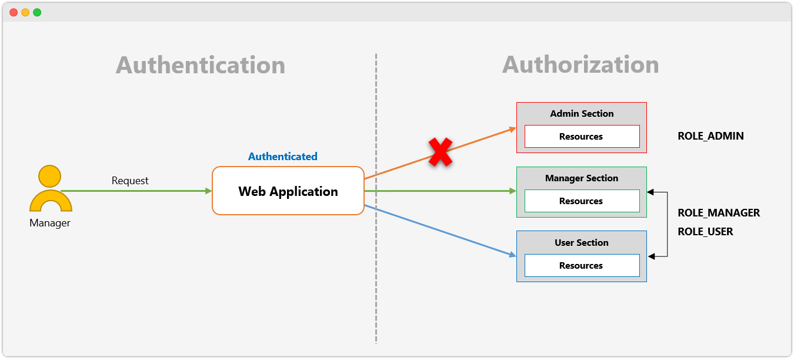
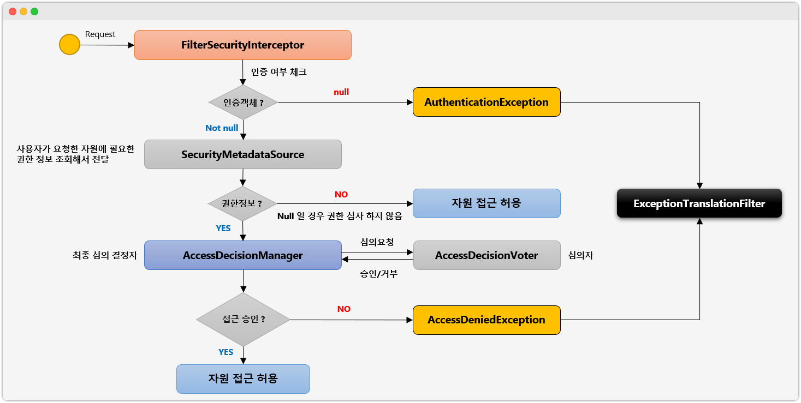
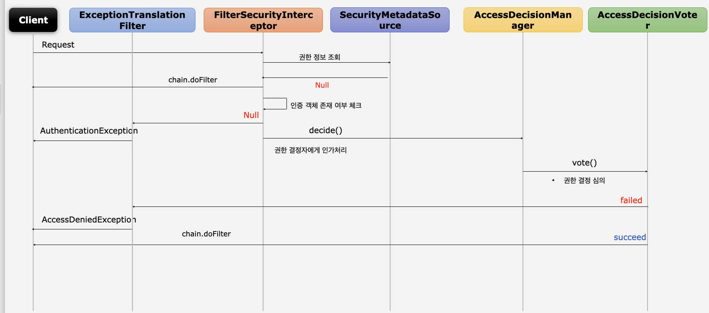
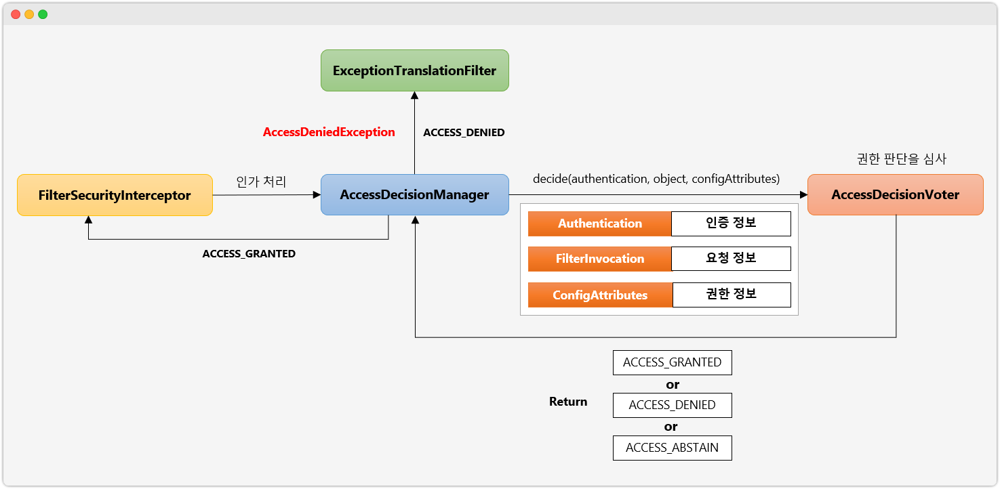

## AuthenticationManager ~ 스프링 시큐리티 필터 및 아키텍처 정리

# AuthenticationManager

```java
public interface AuthenticationManager {
	Authentication authenticate(Authentication authentication) throws AuthenticationException;
}
```



- 사용자의 아이디/ 비밀번호 인증이 유효한 인증인지 확인하는 곳
- 대표적인 구현체는 `ProviderManger`
- 적합한 `AuthenticationProvider`을 찾아 인증 책임을 위임
  - AuthenticationProvider의 반환값이 null이 아닐때까지 `AuthenticationProvider`List 반복
  - 현 ProviderManager에서 적절한 AuthenticationProvider을 찾지 못한 경우 부모까지 타고 들어가 찾는 과정 반복
  - 부모-자식관계는 `AuthenticationMangerBuilder`으로 변경가능

<br/>

# AuthenticationProvider

```java
public interface AuthenticationProvider {
	Authentication authenticate(Authentication authentication) throws AuthenticationException;
	boolean supports(Class<?> authentication);
}
```



- 타입별 인증제공자
- 대표적인 구현체는 form로그인 처리를 하는 `DaoAuthenticationProvider`
- `supperts()`를 통해 전달받은 인증객체를 지원하는지 체크
- true일 경우 authenticate(...)실행
  - ID 검증 : `UserDetailsService`를 통해 ID와 매칭되는 사용자 정보 조회
    - `UserNotFoundException` 예외 발생
  - PW 검증 : 요청된 PW와 사용자정보의 PW정보를 비교
    - `BadCredentialException` 예외 발생
  - 추가검증 : ID, PW 모두 검증 성공시 사용자 정보와 권한 정보를 담은 인증객체 생성 및 반환

<br/>

# Authorization, FilterSecurityInterceptor 

## Authorization



- 인증받은 사용자가 자원에 접근할 수 있는 자격이 있는지 증명하는 것

### 권한 계층

- 웹 계층 : URL요청에 따른 인가처리 (/user)
- 서비스 계층 : 메소드 단위의 인가처리 (user())
- 도메인 계층 : 객체 단위의 인가처리 (User)

## FilterSecurityInterceptor



- 시큐리티 필터의 마지막 필터이며, 인가처리 담당 필터
- 인증된 사용자의 요청 승인/거부 최종 결정
- 인증 객체가 없을 경우 `AuthenticationException`
- 인증 후 자원 접근 권한이 없을 경우 `AccessDeniedException`
- 권한 제어 방식 중 HTTP 자원의 보안
- `AccessDecisionManger`에게 인가 처리 위임
  - 인가처리는 `AccessDecisionVoter`에 의해 접근 찬/반 결정

### Flow



<br/>

# AccessDecisionManager, AccessDecisionVoter



- FilterSecurityInterceptor가 `AccessDesicionManger`에게 인가처리 위임
  - 인증, 요청, 권한정보 전달
- AccessDecisionManger는 자신이 가진 Voter를 통해 자원 접근 찬/반 판단
  - 찬/반여부 종류
    - 접근 허용, 거부, 보류 리턴

## 접근 결정의 세 가지 유형

- AffirmativeBased
  - Voter중 하나라도 접근 허용일 경우 PASS
- ConsensusBased
  - 다수결로 최종결정 판단
  - 동수일 경우 default는 접근허가
  - allowIfEqualGrantedDeniedDecisions가 false로 설정된 경우, 접근 거부
- UnanimousBased
  - 만장일치로 접근 승인시 접근 허용

## AccessDecisionVoter

- 실질적인 잡근 접근 허용 Voter
- 접근허용심사에 사용하는 것
  - Authentication : 인증 정보
  - FilterInvocation : 요청 정보, antMatcher("/user")
  - ConfigAttributes : 권한 정보, hasRole("USER")
- 리턴타입
  - ACCESS_GRANTED : 접근허용(1)
  - ACCESS_DENIED : 접근거부(-1)
  - ACCESS_ABSTAINA : 접근보류(0)