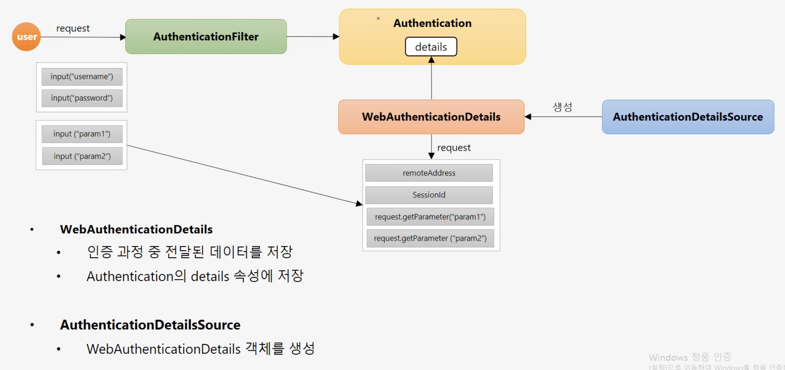

# 섹션 3. 실전프로젝트 -인증 프로세스 Form 인증 구현

## 1) 실전 프로젝트 구성
##### 1. 프로젝트 명
- core-spring-security
##### 2. 프로젝트 기본 구성
- 의존성 설정, 환경설정, UI 화면 구성, 기본 CRUD 기능
- 스프링 시큐리티 보안 기능을 점진적으로 구현 및 완성
##### 3. Springboot, Spring MVC, Spring Data JPA
- 스프링 시큐리티 기술에 집중
##### 4. 프로그램 설치
- Postgresql

## 2) 정적 자원 관리 - WebIgnore 설정
- `WebSecurityConfigurerAdapter`를 상속받은 config 파일 내
	- `public void configure(WebSecurity web)`를 Override 한다.
- js / css / image 파일 등 보안 필터를 적용할 필요가 없는 리소스를 설정
```java
web.ignoring().requestMatchers(PathRequest.toStaticResources().atCommonLocations());
```

## 3) 사용자 DB 등록 및 PasswordEncoder
```java
@Entity
@Data
public class Account {
	@id
	@GeneratedValue
	private Long id;
	private String username;
	...
}
```
- @Entity : JPA 기술. 필드 하나하나와 데이터베이스 정보가 매핑된다.
- @Data : lombok

```
# application.properties 파일
spring.datasource.url=jdbc:postgresql://localhost:5432/springboot  
spring.datasource.username=postgres  
spring.datasource.password=pass  
  
spring.jpa.hibernate.ddl-auto=create-drop  
spring.jpa.database-platform=org.hibernate.dialect.PostgreSQLDialect  
spring.jpa.properties.hibernate.format_sql=true  
spring.jpa.properties.hibernate.show_sql=true  
spring.jpa.properties.hibernate.jdbc.lob.non_contextual_creation=true  
  
spring.thymeleaf.cache=false  
  
spring.devtools.livereload.enabled=true  
spring.devtools.restart.enabled=true  
  
spring.main.allow-bean-definition-overriding=true
```
- `spring.jpa.hibernate.ddl-auto=create` 옵션은 어플리케이션에 필요한 테이블을 자동으로 생성해 주는 jpa 기술

```java
// UserController.java 내부
@PostMapping(value="/users")  
public String createUser(AccountDto accountDto) throws Exception {  
  
    ModelMapper modelMapper = new ModelMapper();  
    Account account = modelMapper.map(accountDto, Account.class);  
    account.setPassword(passwordEncoder.encode(accountDto.getPassword()));  
    userService.createUser(account);  
  
    return "redirect:/";  
}
```

## 4, 5) DB연동 인증 처리 : CustomUserDetailService

```java
// security.configs.SecurityConfig.java
@Autowired  
private UserDetailsService userDetailsService;  
  
@Override  
protected void configure(AuthenticationManagerBuilder auth) throws Exception {  
    auth.authenticationProvider(authenticationProvider());  
}  
  
private AuthenticationProvider authenticationProvider() {  
    return new CustomAuthenticationProvider(userDetailsService, passwordEncoder());  
}  
  
@Bean  
public PasswordEncoder passwordEncoder() {  
    return PasswordEncoderFactories.createDelegatingPasswordEncoder();  
}
```
- 위와 같이 AuthenticationProvider를 커스텀하여, 커스텀 된 클래스를 사용하라고 지정해 줄 수 있다.

```java
// security.provider.CustomAuthenticationProvider.java
@RequiredArgsConstructor  
public class CustomAuthenticationProvider implements AuthenticationProvider {  
  
    private final UserDetailsService userDetailsService;  
  
    private final PasswordEncoder passwordEncoder;  
  
    @Override  
    public Authentication authenticate(Authentication authentication) throws AuthenticationException {  
  
        String username = authentication.getName();  
        String password = (String)authentication.getCredentials();  
  
        AccountContext accountContext = (AccountContext) userDetailsService.loadUserByUsername(username);  
  
        if(!passwordEncoder.matches(password, accountContext.getAccount().getPassword())) {  
            throw new BadCredentialsException("BadCredentialsException");  
        }  
  
        UsernamePasswordAuthenticationToken authenticationToken = new UsernamePasswordAuthenticationToken(accountContext.getAccount(), null, accountContext.getAuthorities());  
  
        return authenticationToken;  
    }  
  
    @Override  
    public boolean supports(Class<?> authentication) {  
        return UsernamePasswordAuthenticationToken.class.isAssignableFrom(authentication);  
    }  
}
```
- userDetailsService에서 유저이름으로 검색한 결과의 비밀번호와 입력된 비밀번호의 인코딩 된 버전을 비교해준다.
	- 비교 결과가 같을 시 토큰 발행
	- 비교 결과가 다를 시 BadCredentialsException 발생

```java
// security.service.CustomUserDetailsService.java
@Service("userDetailsService")  
public class CustomUserDetailsService implements UserDetailsService {  
  
    @Autowired  
    private UserRepository userRepository;  
  
    @Override  
    public UserDetails loadUserByUsername(String username) throws UsernameNotFoundException {  
        // 유저네임으로 계정 정보 가져오기  
        Account account = userRepository.findByUsername(username);  
  
        if (account == null) {  
            throw new UsernameNotFoundException("UsernameNotFoundException");  
        }  
  
        // 계정 정보에 저장된 role들을 grantedAuthority로 저장  
        List<GrantedAuthority> roles = new ArrayList<>();  
        roles.add(new SimpleGrantedAuthority(account.getRole()));  
  
        // 계정에 roles를 부여하고 반환  
        AccountContext accountContext = new AccountContext(account, roles);  
  
        return accountContext;  
    }  
}
```

## 6) 커스텀 로그인 페이지 생성하기
```java
@Override  
protected void configure(HttpSecurity http) throws Exception {  
    http  
            .authorizeRequests()  
            .antMatchers("/", "/users", "user/login/**").permitAll()  
            .antMatchers("/mypage").hasRole("USER")  
            .antMatchers("/messages").hasRole("MANAGER")  
            .antMatchers("/config").hasRole("ADMIN")  
            .anyRequest().authenticated()  
  
    .and()  
            .formLogin()  
            .loginPage("/login")  
            .loginProcessingUrl("/login_proc")  
            .defaultSuccessUrl("/")  
            .permitAll()  
    ;  
}
```
- 위와 같이 로그인 페이지의 위치, 로그인 진행해줄 controller의 url, 성공시 이동할 url을 주어서 커스텀 할 수 있다.

## 7) 로그아웃 및 인증에 따른 화면 보안 처리
- 로그아웃 방법
	- form 태그를 사용해 POST로 요청
	- a 태그를 사용해 GET으로 요청 - **SecurityContextLogoutHandler** 활용
- 인증 여부에 따라 로그인 / 로그아웃 표현
```html
<li class="nav-item" sec:authorize="isAnonymous()" ><a class="nav-link text-light" th:href="@{/login}">로그인</a></li>  
<li class="nav-item" sec:authorize="isAuthenticated()"><a class="nav-link text-light" th:href="@{/logout}">로그아웃</a></li>
```
- sec:authorize="isAnonymous()", sec:authorize="isAuthenticated()"로 인증 여부를 구분한다.
- 위의 식은 thymeleaf에서 제공

## 8) 인증 부가 기능
### WebAuthenticationDetails, AuthenticationDetailsSource

- AuthenticationDetailsSource가 생성한 WebAuthenticationDetails
	- Authentication의 details 속성에 저장된다.
	- 인증 과정 중 전달된 데이터를 저장한다.

```java
// FormAuthenticationDetailsSource.java
@Component  
public class FormAuthenticationDetailsSource implements AuthenticationDetailsSource<HttpServletRequest, WebAuthenticationDetails> {  
    @Override  
    public WebAuthenticationDetails buildDetails(HttpServletRequest context) {  
        return new FromWebAuthenticationDetails(context);  
    }  
}
```
- 디테일 소스를 Component로 만든다.

```java
// FormWebAuthenticationDetails.java
public class FormWebAuthenticationDetails extends WebAuthenticationDetails {  
  
    private String secretKey;  
  
    public FormWebAuthenticationDetails(HttpServletRequest request) {  
        super(request);  
        secretKey = request.getParameter("secret_key");  
    }  
  
    public String getSecretKey() {  
        return secretKey;  
    }  
}
```
- 위의 클래스 객체를 디테일 소스를 통해 만들게 된다.

```java
@Override  
protected void configure(HttpSecurity http) throws Exception {  
    http  
          //...생략
    .and()  
            .formLogin()  
            .loginPage("/login")  
            .loginProcessingUrl("/login_proc")  
            // authenticationDetailsSource를 지정해 줄 수 있다.
            // Bean Component로 만든 디테일 소스를 DI 받아 파라미터로 준다.
            .authenticationDetailsSource(authenticationDetailsSource)
            .defaultSuccessUrl("/")  
            .permitAll()  
    ;  
}
```

```java
// CustomAuthenticationProvider.java

//  UsernamePasswordAuthenticationToken authenticationToken = new UsernamePasswordAuthenticationToken(accountContext.getAccount(), null, accountContext.getAuthorities());
FormWebAuthenticationDetails formWebAuthenticationDetails = (FormWebAuthenticationDetails) authentication.getDetails();  
String secretKey = formWebAuthenticationDetails.getSecretKey();  
if (secretKey == null || "secret".equals(secretKey)) {  
	throw new InsufficientAuthenticationException("InsufficientAuthenticationException");  
}  
```
- provider에서 디테일을 검사하도록 만든다.
	- 위는 secretKey가 없거나 "secret"이 아니라면 오류 발생하는 코드
- 꼭 인증에 사용하기 보단 전역으로 Detail 정보를 저장하여 사용하고 싶을 때 사용할 수 있다.

## 9) 인증 성공 핸들러
### CustomAuthenticationSuccessHandler
```java
// CustomAuthenticationSuccessHandler.java
@Component  
public class CustomAuthenticationSuccessHandler extends SimpleUrlAuthenticationSuccessHandler {  
  
    private RequestCache requestCache = new HttpSessionRequestCache();  
  
    private RedirectStrategy redirectStrategy = new DefaultRedirectStrategy();  
  
    @Override  
    public void onAuthenticationSuccess(HttpServletRequest request, HttpServletResponse response, Authentication authentication) throws IOException, ServletException {  
  
        setDefaultTargetUrl("/");  
        // 원래 가고자 했던 url을 가지고 있다  
        SavedRequest savedRequest = requestCache.getRequest(request, response);  
        if (savedRequest != null) {  
            String targetUrl = savedRequest.getRedirectUrl();  
            redirectStrategy.sendRedirect(request, response, targetUrl);  
        } else {  
            redirectStrategy.sendRedirect(request, response, getDefaultTargetUrl());  
        }  
  
    }  
}
```

## 10) 인증 실패 핸들러
### CustomAuthenticationFailureHandler
```java
// CustomAuthenticatioinFailureHandler.java
@Component  
public class CustomAuthenticatioinFailureHandler extends SimpleUrlAuthenticationFailureHandler {  
    @Override  
    public void onAuthenticationFailure(HttpServletRequest request, HttpServletResponse response, AuthenticationException exception) throws IOException, ServletException {  
  
        String errorMessage = "Invalid Username or Password";  
  
        if (exception instanceof BadCredentialsException) {  
            errorMessage = "Invalid Username or Password";  
        } else if (exception instanceof InsufficientAuthenticationException) {  
            errorMessage = "Invalid Secret Key";  
        }  
  
        setDefaultFailureUrl("/login?error=true&exception=" + exception.getMessage());  
  
        super.onAuthenticationFailure(request, response, exception);  
    }  
}
```
- 위의 두 handler는 SecurityConfig.java 파일에서 설정해준다.
```java
protected void configure(HttpSecurity http) throws Exception {  
    http  
		// ... 생략
.and()  
		.formLogin()  
		.loginPage("/login")  
		.loginProcessingUrl("/login_proc")  
		.authenticationDetailsSource(authenticationDetailsSource)  
		.defaultSuccessUrl("/")  
		// 각각 success, failure 핸들러
		.successHandler(customAuthenticationSuccessHandler)  
		.failureHandler(customAuthenticationFailureHandler)  
		.permitAll()  
    ;  
}
```

## 11) 인증 거부 처리 - Access Denied
```java
// CustomAccessDeniedHandler.java
public class CustomAccessDeniedHandler implements AccessDeniedHandler {  
  
    private String errorPage;  
  
    @Override  
    public void handle(HttpServletRequest request, HttpServletResponse response, AccessDeniedException accessDeniedException) throws IOException, ServletException {  
        String deniedUrl = errorPage + "?exception=" + accessDeniedException.getMessage();  
        response.sendRedirect(deniedUrl);  
    }  
  
    public void setErrorPage(String errorPage) {  
        this.errorPage = errorPage;  
    }  
}
```
- 위 클래스도 마찬가지로 SecurityConfig.java에서 처리한다.
```java
    http  
            .exceptionHandling()  
            .accessDeniedHandler(accessDeniedHandler());  
}  
  
private AccessDeniedHandler accessDeniedHandler() {  
    CustomAccessDeniedHandler accessDeniedHandler = new CustomAccessDeniedHandler();  
    accessDeniedHandler.setErrorPage("/denied");  
    return accessDeniedHandler;  
}
```
- access denied 될 때마다 핸들러를 자동 호출하게 된다.