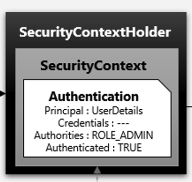
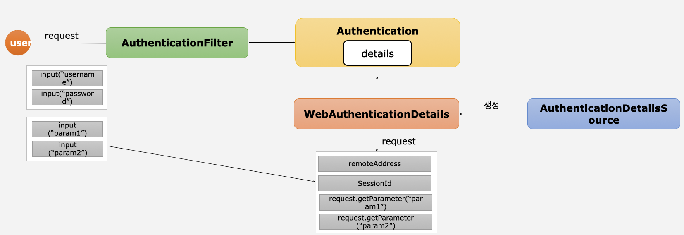

# 인증 프로세스 구현
## 실전 프로젝트 구성

- gradle, spring boot, h2 DB사용
- 인증/인가 프로세스 구현

### build.gradle

```gradle
plugins {
    id 'java'
    id 'org.springframework.boot' version '2.7.4'
    id 'io.spring.dependency-management' version '1.1.4'
}

group = 'spring'
version = '0.0.1-SNAPSHOT'

java {
    sourceCompatibility = '17'
}

configurations {
    compileOnly {
        extendsFrom annotationProcessor
    }
}

repositories {
    mavenCentral()
}

dependencies {
    implementation 'org.springframework.boot:spring-boot-starter-data-jpa'
    implementation 'org.springframework.boot:spring-boot-starter-security'
    implementation 'org.springframework.boot:spring-boot-starter-thymeleaf'
    implementation 'org.springframework.boot:spring-boot-starter-web'
    implementation 'org.thymeleaf.extras:thymeleaf-extras-springsecurity5'
    implementation group: 'org.modelmapper', name: 'modelmapper', version: '2.3.8'
    compileOnly 'org.projectlombok:lombok'
    runtimeOnly 'com.h2database:h2'
    developmentOnly 'org.springframework.boot:spring-boot-devtools'
    annotationProcessor 'org.springframework.boot:spring-boot-configuration-processor'
    implementation 'org.springframework.boot:spring-boot-starter-jdbc'
    annotationProcessor 'org.projectlombok:lombok'
    testImplementation 'org.springframework.boot:spring-boot-starter-test'
    testImplementation 'org.springframework.security:spring-security-test'
}

tasks.named('test') {
    useJUnitPlatform()
}
```

### application.properties

```properties
spring.datasource.url=jdbc:h2:tcp://localhost/~/springsecurity
spring.datasource.driver-class-name=org.h2.Driver
spring.datasource.username=sa
spring.datasource.password=
spring.jpa.database-platform=org.hibernate.dialect.H2Dialect
spring.jpa.properties.hibernate.dialect=org.hibernate.dialect.H2Dialect

spring.jpa.hibernate.ddl-auto=none
spring.jpa.properties.hibernate.format_sql=true
spring.jpa.properties.hibernate.show_sql=true
spring.jpa.properties.hibernate.jdbc.lob.non_contextual_creation=true

spring.thymeleaf.cache=false

spring.devtools.livereload.enabled=true
spring.devtools.restart.enabled=true

spring.main.allow-bean-definition-overriding=true
```

## 메뉴 권한 및 WebIgnore 설정

### WebIgnore 설정

```java
@Override
public void configure(WebSecurity web) throws Exception {
    web.ignoring().requestMatchers(PathRequest.toStaticResources().atCommonLocations());
}
```
- **WebSecurity** : HttpSecurity 앞단에서 먼저 처리됨
- 스프링 시큐리티는 기본적으로 모든 접근에 대해서 인증/인가 검사 실행
- WebIgnore을 설정하여 정적인 자원에 대해 인증/인가 검사X

```java
public enum StaticResourceLocation {
  CSS(new String[]{"/css/**"}),
  JAVA_SCRIPT(new String[]{"/js/**"}),
  IMAGES(new String[]{"/images/**"}),
  WEB_JARS(new String[]{"/webjars/**"}),
  FAVICON(new String[]{"/favicon.*", "/*/icon-*"});
  ...
}
```

#### permitAll vs Ignore

- 공통점
  - 인증 없이 자원에 접근 가능
- 차이점
  - **permitAll**
    - 스프링 시큐리티의 모든 보안 필터를 거쳐서 DispatcherServlet으로 넘어감(무시)
  - **Ignore**
    - 스프링 시큐리티의 필터를 거치지 않음(생략)

## Form 인증 – User 등록 / PasswordEncoder
### PasswordEncoder

```java
    @Bean
    PasswordEncoder passwordEncoder() {
        return PasswordEncoderFactories.createDelegatingPasswordEncoder();
    }
```

- 비밀번호 암호화해주는 인터페이스
- 암호화 포맷 : {id}encodedPassword
- 암호화 알고리즘 종류
```java
    public static PasswordEncoder createDelegatingPasswordEncoder() {
        String encodingId = "bcrypt";
        Map<String, PasswordEncoder> encoders = new HashMap();
        encoders.put(encodingId, new BCryptPasswordEncoder());
        encoders.put("ldap", new LdapShaPasswordEncoder());
        encoders.put("MD4", new Md4PasswordEncoder());
        encoders.put("MD5", new MessageDigestPasswordEncoder("MD5"));
        encoders.put("noop", NoOpPasswordEncoder.getInstance());
        encoders.put("pbkdf2", new Pbkdf2PasswordEncoder());
        encoders.put("scrypt", new SCryptPasswordEncoder());
        encoders.put("SHA-1", new MessageDigestPasswordEncoder("SHA-1"));
        encoders.put("SHA-256", new MessageDigestPasswordEncoder("SHA-256"));
        encoders.put("sha256", new StandardPasswordEncoder());
        encoders.put("argon2", new Argon2PasswordEncoder());
        return new DelegatingPasswordEncoder(encodingId, encoders);
    }
```
- 메소드
```java
public interface PasswordEncoder {
    String encode(CharSequence rawPassword); // 비밀번호 암호화

    boolean matches(CharSequence rawPassword, String encodedPassword); // 로그인한 비밀번호와 계정의 비밀번호 매칭 확인
  ...
}
```

### 회원가입

#### config

```java
@Configuration
@EnableWebSecurity
@Slf4j
public class SecurityConfig extends WebSecurityConfigurerAdapter {
  @Bean
  PasswordEncoder passwordEncoder() {
    return PasswordEncoderFactories.createDelegatingPasswordEncoder();
  }
    @Override
    protected void configure(HttpSecurity http) throws Exception {
        http.
                authorizeRequests()
                .antMatchers("/", "/users", "user/login/**", "/login*").permitAll()
                .antMatchers("/mypage").hasRole("USER")
                .antMatchers("/messages").hasRole("MANAGER")
                .antMatchers("/config").hasRole("ADMIN")
                .anyRequest().authenticated() // 1
                .and()
                .formLogin() // 2
                .loginPage("/login"); // 3
    }
}
```

1. 인증받지 않은 사용자도 로그인/회원가입/홈페이지는 접속해야하기 때문에 permitAll설정 
2. form형식 로그인 
3. 커스텀한 로그인페이지 사용 설정

#### controller

```java
	@GetMapping("/users")
	public String createUser() throws Exception {
		return "user/login/register";
	} // 1

	@PostMapping("/users")
	public String createUser(AccountDto accountDto){ // 2
		ModelMapper modelMapper = new ModelMapper(); // 3
		Account account = modelMapper.map(accountDto, Account.class);
		account.setPassword(passwordEncoder.encode(account.getPassword())); // 4
		userService.createUser(account); // 5
		return "redirect:/";
	}
```
1. 사용자가 회원가입페이지(/users) 접속
2. 사용자가 회원가입요청(/users)
3. ModelMapper를 통해 Dto를 엔티티에 매칭시킴
4. 사용자가 가입하려는 계정의 비밀번호를 암호화하여 엔티티에 넣음
5. Service단에 비지니스 로직 처리

> :exclamation: **DTO vs Entity** <br/>
> 
> **DTO**<br/>
> 레이어간(View -> Controller) 데이터를 전달하기 위한 객체<br/>
> DB단에서 클라이언트에게 보여져도 되는 정보를 담아 보낼 수 있음
> 
> **Entity**<br/>
> 실제 DB 테이블과 매핑되는 클래스로, 이를 통해 테이블이 생성되고 스키마가 변경됨<br/>
> 변경되면 안되기 때문에 요청/응답을 전달하는 클래스로 사용해서는 안됨<br/>
> setter지양(객체의 일관성, 안정성을 위함)<br/>
> 생성자/Builder를 사용하여 불변객체로 활용할 수있기 때문에 데이터의 일관성을 보장<br/>

## Form 인증 – CustomUserDetailsService

### 로그인

> controller -> filter -> service -> repository -> filter -> controller
- **UserDetails** : 스프링 시큐리티에서 사용자의 정보를 담는 인터페이스
- **UserDetailsService** : 스프링 시큐리티에서 유저의 정보를 가져오는 인터페이스, 로그인 담당 서비스
- **AuthenticationProvider** : DB에 저장된 정보와 사용자가 로그인하려는 정보가 유효한지 체크하는 인터페이스
1. 사용자가 로그인(POST /login) 요청
2. `usernamePasswordAuthenticationFilter`(인증필터)가 요청정보를 받아서 정보 추출, `Authentication`(인증객체) 생성 
3. `AuthenticationManager`를 거쳐 비밀번호가 없는 `Authentication`반환
4. `SecurityContextHolder`안의 `SecurityContext`에 저장

### config

```java
@Configuration
@EnableWebSecurity
@Slf4j
public class SecurityConfig extends WebSecurityConfigurerAdapter {

    @Autowired
    private AuthenticationSuccessHandler authenticationSuccessHandler;
    @Autowired
    private AuthenticationFailureHandler authenticationFailureHandler;
    @Autowired
    private FormAuthenticationDetailsSource authenticationDetailsSource;

    @Bean
    PasswordEncoder passwordEncoder() {
        return PasswordEncoderFactories.createDelegatingPasswordEncoder();
    }

    @Bean
    AuthenticationProvider authenticationProvider() {
        return new FormAuthenticationProvider(passwordEncoder());
    } // 1

    @Override
    protected void configure(HttpSecurity http) throws Exception {
        http.
                authorizeRequests()
                .antMatchers("/", "/users", "user/login/**", "/login*").permitAll()
                .antMatchers("/mypage").hasRole("USER")
                .antMatchers("/messages").hasRole("MANAGER")
                .antMatchers("/config").hasRole("ADMIN")
                .anyRequest().authenticated()
                .and()
                .formLogin()
                .loginPage("/login")
                .loginProcessingUrl("/login_proc")
        ;
    }

    @Override
    protected void configure(AuthenticationManagerBuilder auth) throws Exception {
        auth.authenticationProvider(authenticationProvider());
    } // 2
}
```

1. AuthenticationProvider 빈 등록
2. userDetailService의 loadUserByUsername을 사용하기 위함

### Authentication

```java
public interface Authentication extends Principal, Serializable {

	Collection<? extends GrantedAuthority> getAuthorities();
	Object getCredentials();
	Object getDetails();
	Object getPrincipal();
	boolean isAuthenticated();
	void setAuthenticated(boolean isAuthenticated) throws IllegalArgumentException;
}
```

### AuthenticationProvider


```java
public class FormAuthenticationProvider implements AuthenticationProvider {

  @Autowired
  private UserDetailsService userDetailsService;
  private PasswordEncoder passwordEncoder;

  public FormAuthenticationProvider(PasswordEncoder passwordEncoder) {
    this.passwordEncoder = passwordEncoder;
  }

  @Override
  @Transactional
  public Authentication authenticate(Authentication authentication) throws AuthenticationException {
    String username = authentication.getName(); // 1
    String password = (String) authentication.getCredentials(); // 2
    
    // 3
    AccountContext accountContext = (AccountContext) userDetailsService.loadUserByUsername(username);

    if (!passwordEncoder.matches(password, accountContext.getAccount().getPassword())) {
      throw new BadCredentialsException("BadCredentialsException");
    }
    
    UsernamePasswordAuthenticationToken authenticationToken = new UsernamePasswordAuthenticationToken(accountContext.getAccount(), null, accountContext.getAuthorities());
    return authenticationToken;
  }

  @Override
  public boolean supports(Class<?> authentication) {
    return UsernamePasswordAuthenticationToken.class.isAssignableFrom(authentication);
  } // 4
}
```
- DB에 저장된 정보와 사용자가 로그인하려는 정보가 유효한지 체크하는 인터페이스
1. 사용자가 로그인하려는 아이디 정보
2. 사용자가 로그인하려는 비밀번호 정보
3. DB에서 사용자가 입력한 아이디와 매칭되는 계정이 있는지 확인
4. `AuthenticationManger`가 인증을 넘겨줄 `AuthenticationProvider`를 설택할 때 사용 
   - 매개변수로 받은 `Authentication`의 구현체 클래스가 해당 `AuthenticationProvider`에서 사용하는지 확인

### UserDetailsService


```java
@Service("userDetailService")
@RequiredArgsConstructor
public class CustomUserDetailService implements UserDetailsService {

    private final UserRepository userRepository;

    @Override
    public UserDetails loadUserByUsername(String username) throws UsernameNotFoundException {
        Account account = userRepository.findByUsername(username); // 1
        if(account==null){
            throw new UsernameNotFoundException("UsernameNotFoundException");
        } // 2
        List<GrantedAuthority> roles = new ArrayList<GrantedAuthority>(); 
        roles.add(new SimpleGrantedAuthority(account.getRole()));

        AccountContext accountContext = new AccountContext(account, roles); // 3
        return accountContext;
    }
}
```

- 로그인 담당 service
1. repository를 거쳐 DB에서 사용자가 로그인한 아이디의 엔티티를 가져옴 
2. 해당하는 엔티티가 없을 경우 예외처리
3. 계정의 권한을 가져와서 UserDetails(accountContext)에 넣음

### UserDetails

```java
public class AccountContext extends User {
    private final Account account;

    public AccountContext(Account account, Collection<? extends GrantedAuthority> authorities) {
        super(account.getUsername(), account.getPassword(), authorities);
        this.account = account;
    }

    public Account getAccount() {
        return account;
    }
}
```

- 인증된 사용자 정보를 담는 인터페이스중 대표적인 구현체 `User`사용
- user를 상속하여 커스텀한 `AccountContext`

```java
public class User implements UserDetails, CredentialsContainer{
    
    private String password;
	private final String username;
	private final Set<GrantedAuthority> authorities;
	private final boolean accountNonExpired;
	private final boolean accountNonLocked;
	private final boolean credentialsNonExpired;
	private final boolean enabled;
    
    public User(String username, String password, Collection<? extends GrantedAuthority> authorities) {
    this(username, password, true, true, true, true, authorities);
	}
  ...
}
```
### AuthenticationProvider

```java
public class FormAuthenticationProvider implements AuthenticationProvider {

  @Autowired
  private UserDetailsService userDetailsService;
  private PasswordEncoder passwordEncoder;

  public FormAuthenticationProvider(PasswordEncoder passwordEncoder) {
    this.passwordEncoder = passwordEncoder;
  }

  @Override
  @Transactional
  public Authentication authenticate(Authentication authentication) throws AuthenticationException {
    String username = authentication.getName(); 
    String password = (String) authentication.getCredentials();
 
    AccountContext accountContext = (AccountContext) userDetailsService.loadUserByUsername(username);

    if (!passwordEncoder.matches(password, accountContext.getAccount().getPassword())) {
      throw new BadCredentialsException("BadCredentialsException");
    } // 1
    
    UsernamePasswordAuthenticationToken authenticationToken = new UsernamePasswordAuthenticationToken(accountContext.getAccount(), null, accountContext.getAuthorities());
    return authenticationToken; // 2
  } 

  @Override
  public boolean supports(Class<?> authentication) {
    return UsernamePasswordAuthenticationToken.class.isAssignableFrom(authentication);
  }
}
```

1. 사용자가 로그인하려는 계정의 비밀번호와 로그인폼에 입력한 비밀번호가 같은지 확인
2. 인증된 유저 토큰(authentication을 상속받은 클래스) 생성하여 반환
3. 로그인 성공

## Form 인증 - 로그아웃

### controller 

```java
    @GetMapping("/logout")
    public String logout(HttpServletRequest request, HttpServletResponse response) {
        Authentication authentication = SecurityContextHolder.getContext().getAuthentication(); // 1
        if (authentication != null) { // 2
            new SecurityContextLogoutHandler().logout(request, response, authentication);
        }
        return "redirect:/login";
    }
```



1. get방식으로 logout할 경우 `SecurityContextLogoutHandler`활용
   - 세션 무효화
   - 인증객체 삭제
   - SecurityContext 삭제
2. 인증된 객체는 SecurityContext에 저장되어 있음
3. 현재 로그인한 사용자인지 체크 후 로그아웃시킴 

## Form 인증 – WebAuthenticationDetails, AuthenticationDetailsSource



- 로그인할 때 아이디와 비밀번호 제외하고 다른 인증정보도 필요할 경우 사용
- **WebAuthenticationDetails** : username과 password외에 추가적인 정보가 필요할 경우 추가적인 정보를 담는 클래스
- **AuthenticationDetailsSource** : WebAuthenticationDetails를 생성하는 인터페이스
1. 사용자 로그인 시도
2. `AuthenticationFilter`를 통해 `Authentication`생성
3. `UsernamePasswordAuthenticationFilter`의 setDetails(request, authRequest)로 details생성
4. `Authentication`안에 details를 만들기 위해 `AuthenticationDetailsSource`가 `WebAuthenticationDetails`를 생성

### config

```java
@Configuration
@EnableWebSecurity
@Slf4j
public class SecurityConfig extends WebSecurityConfigurerAdapter {

    @Autowired
    private FormAuthenticationDetailsSource authenticationDetailsSource;

    @Override
    protected void configure(HttpSecurity http) throws Exception {
        http.
                authorizeRequests()
                .antMatchers("/", "/users", "user/login/**", "/login*").permitAll()
                .antMatchers("/mypage").hasRole("USER")
                .antMatchers("/messages").hasRole("MANAGER")
                .antMatchers("/config").hasRole("ADMIN")
                .anyRequest().authenticated()
                .and()
                .formLogin()
                .loginPage("/login")
                .loginProcessingUrl("/login_proc")
                .authenticationDetailsSource(authenticationDetailsSource) // 1
        ;
    }
  ...
}
```

1. 인증시 추가정보를 검사하기 위한 `AuthenticationDetailsSource`등록

### AuthenticationDetailsSource

```java
@Component
public class FormAuthenticationDetailsSource implements AuthenticationDetailsSource<HttpServletRequest, WebAuthenticationDetails> {
    @Override
    public WebAuthenticationDetails buildDetails(HttpServletRequest context) {
        return new FormWebAuthenticationDetails(context);
    }
}
```

### WebAuthenticationDetails

```java
public class FormWebAuthenticationDetails extends WebAuthenticationDetails {
    private String secretKey;
    public FormWebAuthenticationDetails(HttpServletRequest request) {
        super(request);
        secretKey = request.getParameter("secret_key");
    }

    public String getSecretKey() {
        return secretKey;
    }
}
```

- 인증시 추가로 확인할 정보 등록

### AuthenticationProvider

```java
public class FormAuthenticationProvider implements AuthenticationProvider {

    @Autowired
    private UserDetailsService userDetailsService;
    private PasswordEncoder passwordEncoder;

    public FormAuthenticationProvider(PasswordEncoder passwordEncoder) {
        this.passwordEncoder = passwordEncoder;
    }

    @Override
    @Transactional
    public Authentication authenticate(Authentication authentication) throws AuthenticationException {
        String username = authentication.getName();
        String password = (String) authentication.getCredentials();

        AccountContext accountContext = (AccountContext) userDetailsService.loadUserByUsername(username);

        if (!passwordEncoder.matches(password, accountContext.getAccount().getPassword())) {
            throw new BadCredentialsException("BadCredentialsException");
        }

        FormWebAuthenticationDetails formWebAuthenticationDetails = (FormWebAuthenticationDetails) authentication.getDetails(); // 1
        String secretKey = formWebAuthenticationDetails.getSecretKey(); // 2
        if (secretKey == null || !"secret".equals(secretKey)) { // 3
            throw new InsufficientAuthenticationException("InsufficientAuthenticationException");
        }
        UsernamePasswordAuthenticationToken authenticationToken = new UsernamePasswordAuthenticationToken(accountContext.getAccount(), null, accountContext.getAuthorities());
        return authenticationToken; // 4
    }
  ...
}
```

1. 로그인할 때 사용한 추가정보를 확인하기 위해 authentication에 있는 details가져오기
2. 등록한 추가정보 빼오기
3. 추가정보가 유효한지 체크하기
4. 인증객체 만들기

## Form 인증 – CustomAuthenticationSuccessHandler, CustomAuthenticationFailureHandler

### AuthenticationSuccessHandler

```java
@Component
public class CustomAuthenticationSuccessHandler extends SimpleUrlAuthenticationSuccessHandler {
    private RequestCache requestCache = new HttpSessionRequestCache(); // 1

    private RedirectStrategy redirectStrategy = new DefaultRedirectStrategy();
    @Override
    public void onAuthenticationSuccess(HttpServletRequest request, HttpServletResponse response, Authentication authentication) throws IOException, ServletException {

        setDefaultTargetUrl("/");

        SavedRequest savedRequest = requestCache.getRequest(request, response); // 2
        if(savedRequest!=null){ // 3
            String targetUrl = savedRequest.getRedirectUrl();
            redirectStrategy.sendRedirect(request,response,targetUrl);
        }else{ // 4
            redirectStrategy.sendRedirect(request,response,getDefaultTargetUrl());
        }
    }
}
```
- 로그인 성공시 처리할 로직을 처리하는 handler
1. 사용자가 로그인하기 전 정보를 담고 있는 정보를 가져오기 위함
   - **RequestCache** : SavedRequest 객체를 세션에 저장하는 인터페이스 (구현체는 `HttpSessionRequestCache`)
2. 로그인하기 전 정보를 담고 있는 정보를 가져옴
   - **SavedRequest** : 현재 사용자 정보, 요청 정보 등을를 담고 있는 인터페이스 (구현체는 `DefaultSavedRequest`)
3. 인증되지 않은 사용자가 이전의 접근하려 했던 자원(리소스)가 있는 경우 SavedRequest에 정보가 담겨있음
  - 이전에 접근하려 했던 자원(리소스)를 저장하고 그 자원으로 리다이렉트 시킴
4. 인증되지 않은 사용자가 이전의 접근하려 했던 자원(리소스)가 없는 경우 SavedRequest는 null
   -  setDefaultTargetUrl로 지정해둔 곳으로 리다이렉트 시킴

### AuthenticationFailureHandler


```java
@Component
public class CustomAuthenticationFailureHandler extends SimpleUrlAuthenticationFailureHandler {
  @Override
  public void onAuthenticationFailure(HttpServletRequest request, HttpServletResponse response, AuthenticationException exception) throws IOException, ServletException {

    String errorMessage = "Invalid Username or Password";

    if(exception instanceof BadCredentialsException){
              errorMessage = "Invalid Username or Password";
    }else if(exception instanceof InsufficientAuthenticationException){
              errorMessage = "Invalid Secret Key";
    } // 1

    setDefaultFailureUrl("/login?error=true&exception="+errorMessage); // 2

    super.onAuthenticationFailure(request,response,exception);
  }
}
```

- 로그인 실패시 처리할 로직을 처리하는 handler
1. 로그인이 실패된 예외에 따라 처리 메시지 생성
2. setDefaultFailureUrl()로 이동할 페이지 설정

### config

```java
@Configuration
@EnableWebSecurity
@Slf4j
public class SecurityConfig extends WebSecurityConfigurerAdapter {

    @Autowired
    private AuthenticationSuccessHandler authenticationSuccessHandler;
    @Autowired
    private AuthenticationFailureHandler authenticationFailureHandler;

    @Override
    protected void configure(HttpSecurity http) throws Exception {
        http.
                authorizeRequests()
                .antMatchers("/", "/users", "user/login/**", "/login*").permitAll() 
                // 1
                .antMatchers("/mypage").hasRole("USER")
                .antMatchers("/messages").hasRole("MANAGER")
                .antMatchers("/config").hasRole("ADMIN")
                .anyRequest().authenticated()
                .and()
                .formLogin()
                .loginPage("/login")
                .loginProcessingUrl("/login_proc")
                .authenticationDetailsSource(authenticationDetailsSource)
                .successHandler(authenticationSuccessHandler) // 1
                .failureHandler(authenticationFailureHandler) // 2
                .permitAll()
                ;
    }
  ...
}
```
1. 로그인 실패시 url에 quary string처리
2. 로그인 성공시 처리할 핸들러 설정
3. 로그인 실패시 처리할 핸들러 설정

### controller

```java
    @GetMapping("/login")
    public String login(@RequestParam(value = "error", required = false) String error, 
                        @RequestParam(value = "exception", required = false) String exception, Model model) { // 1
        model.addAttribute("error", error);
        model.addAttribute("exception", exception); // 2

        return "login";
    }
```

1. 로그인 실패시 매칭될 url과 로그인 요청시 매칭될 url 둘다 처리하기 위함
2. 로그인 실패했을 경우 error과 exception은 null이 아니기때문에 model의 attribute등록하여 프론트단에서 처리할 수 있도록 함

## Form 인증 - Access Denied

- 인증된 사용자가 특정 권한이 있는 자원(리소스)에 접근했을 경우 인가예외처리

### config

```java
@Configuration
@EnableWebSecurity
@Slf4j
public class SecurityConfig extends WebSecurityConfigurerAdapter {

    @Override
    protected void configure(HttpSecurity http) throws Exception {
        http.
                authorizeRequests()
                .antMatchers("/", "/users", "user/login/**", "/login*").permitAll()
                .antMatchers("/mypage").hasRole("USER")
                .antMatchers("/messages").hasRole("MANAGER")
                .antMatchers("/config").hasRole("ADMIN")
                .anyRequest().authenticated()
                .and()
                .formLogin()
                .loginPage("/login")
                .loginProcessingUrl("/login_proc")
                .authenticationDetailsSource(authenticationDetailsSource)
                .successHandler(authenticationSuccessHandler)
                .failureHandler(authenticationFailureHandler)
                .permitAll()
                .and()
                .exceptionHandling()
                .accessDeniedHandler(accessDeniedHandler()) // 1
        ;
    }

    @Bean
    public AccessDeniedHandler accessDeniedHandler() { // 2
        CustomAccessDeniedHandler customAccessDeniedHandler = new CustomAccessDeniedHandler();
        customAccessDeniedHandler.setErrorPage("/denied");
        return customAccessDeniedHandler;
    }
  ...
}
```

1. 인가예외가 발생했을 경우 처리할 handler 설정
2. 이동할 페이지(controller) 설정 후 빈등록

### AccessDeniedHandler

```java
public class CustomAccessDeniedHandler implements AccessDeniedHandler {
    private String errorPage;

    @Override
    public void handle(HttpServletRequest request, HttpServletResponse response, AccessDeniedException accessDeniedException) throws IOException, ServletException {
        String deniedUrl = errorPage + "?exception=" + accessDeniedException.getMessage(); // 1
        response.sendRedirect(deniedUrl);
    }

    public void setErrorPage(String errorPage) {
        this.errorPage = errorPage;
    }
}
```

1. 인가예외 발생시 이동할 url 설정

### controller

```java
    @GetMapping("/denied")
    public String accessDenied(@RequestParam(value = "exception", required = false) String exception, Model model) {
        Authentication authentication = SecurityContextHolder.getContext().getAuthentication();
        Account account = (Account) authentication.getPrincipal();
        model.addAttribute("username", account.getUsername());
        model.addAttribute("exception", exception);
        return "user/login/denied";
    }
```